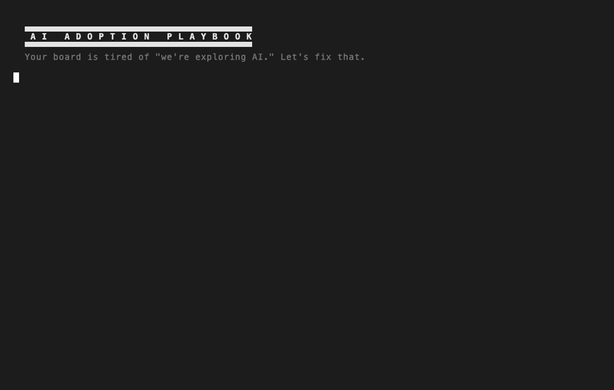

# AI Adoption Playbook

*From "we're exploring AI" to board-ready results.*

A skills framework for leaders responsible for AI adoption — founders, CTOs, CAIOs, VPs of Engineering, VPs of Sales, COOs, heads of Marketing or Operations, consultants, PE operating partners, or anyone who needs to show the board that AI investment is producing results.

<p align="center">
  
</p>

## The Problem

Leadership asks "what's your AI strategy?" You bought tool licenses. You told the team to use them. Nothing happened. Next board meeting, you say "we're exploring AI." The board is unimpressed. Repeat.

This playbook breaks that loop with a structured process: diagnose what's stuck, build a plan with owners and milestones, and produce board-ready updates with real numbers.

## Quick Start

1. Clone this repo
2. Open it in [Claude Code](https://docs.anthropic.com/en/docs/claude-code)
3. Say one of:
   - **"My board is asking about our AI strategy"** — Stage 1: diagnoses adoption blockers, builds the rollout plan
   - **"My CFO doesn't believe my AI numbers"** — Stage 2: diagnoses reporting readiness (outcome rigor, risk posture, board defensibility)

The playbook will run the right diagnostic and guide you to the next step.

## Skills

### Component Skills
| Skill | What it produces |
|-------|-----------------|
| `adoption-scorecard` | Snapshot of who uses what AI tools, how often, how well |
| `board-ai-update` | Board-ready narrative with specific numbers |
| `tool-stack-audit` | What you pay for vs. what gets used |
| `roi-calculator` | Quantified impact across four dimensions — cost efficiency, revenue optimization, new revenue, and capacity gained (revenue per FTE) |

### Interactive Skills
| Skill | What it does |
|-------|-------------|
| `fluency-assessment` | Entry point — scores your team across three pillars (psychological barriers, integration, ownership) |
| `reporting-readiness-assessment` | Stage 2 — scores reporting maturity across three pillars (outcome rigor, risk posture, board defensibility) |
| `blocker-diagnosis` | Deep dive into what's stuck and why |
| `first-use-case-picker` | Finds the right starting point for maximum visible wins |
| `90-day-plan-builder` | Phased rollout with board-cycle milestones |
| `board-narrative-coach` | Practice with a skeptical VC, then draft the update |

### Workflow Skills
| Skill | What it orchestrates |
|-------|---------------------|
| `full-adoption-cycle` | Assessment -> diagnosis -> use case -> plan -> narrative |
| `quarterly-review` | Re-assess, compare to last quarter, generate board update |

## How It Works

The playbook runs in two stages.

**Stage 1 — Adoption.** Every AI adoption failure maps to one of three pillars:

1. **Psychological barriers** — fear, identity threat, "I don't need it"
2. **Integration failures** — tools don't fit workflows, wrong use cases, too much friction
3. **Ownership gaps** — nobody owns it, no metrics, no accountability

The `fluency-assessment` diagnoses which pillars are blocking you. Other skills then fix them in an order that produces results.

**Stage 2 — Reporting.** Once adoption is underway (Integration ≥ 3/5), the question shifts from "are we using AI?" to "can we defend the value to the board?" That's a different gap with three different pillars:

1. **Outcome rigor** — cost methodology, speed baselines, revenue attribution
2. **Risk posture** — tier classification, EU AI Act readiness, incident logging
3. **Board defensibility** — reporting cadence, CFO-approved methodology, outcome vs activity discipline

The `reporting-readiness-assessment` diagnoses Stage 2. `roi-calculator` and `board-ai-update` close the gaps it surfaces.

Works for engineering, sales, and other functional teams — the playbook detects your team type at the start and adapts its probes, examples, and metrics accordingly.

## Installation

### For Claude Cowork (no technical setup)

1. Download the latest `ai-adoption-playbook.zip` from the [Releases page](https://github.com/adimango/ai-adoption-playbook/releases).
2. Open Claude Desktop and switch to the **Cowork** tab.
3. Click **Plugins** in the sidebar, then the **+** button, then **Upload**.
4. Select the downloaded `ai-adoption-playbook.zip`.

Once installed, say one of the Quick Start phrases above and the playbook takes over.

### For Claude Code (CLI)

```bash
/plugin marketplace add adimango/ai-adoption-playbook
/plugin install ai-adoption-playbook@ai-adoption-playbook
```

**Or clone and use directly:**

```bash
git clone https://github.com/adimango/ai-adoption-playbook.git
cd ai-adoption-playbook
claude --plugin-dir .
```

Skills are namespaced as `/ai-adoption-playbook:skill-name` (e.g., `/ai-adoption-playbook:fluency-assessment`).

Future: MCP server packaging for use with Cursor and other MCP-compatible clients.

## License

MIT
