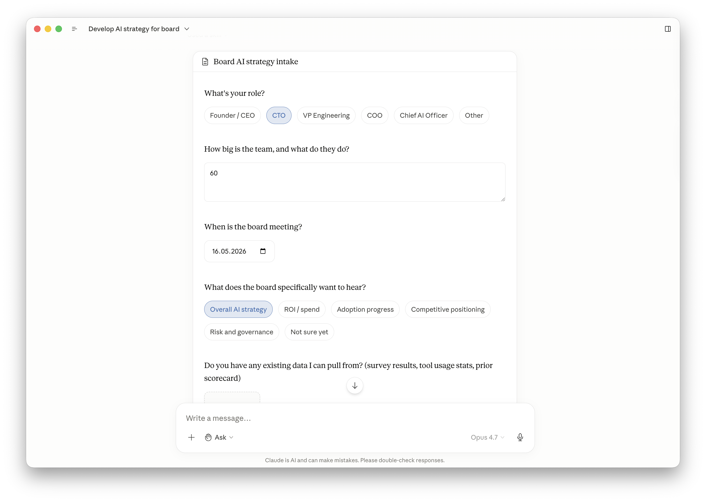

# AI Adoption Playbook

*From "we're exploring AI" to board-ready results.*

A skills framework for leaders responsible for AI adoption — a consulting methodology in agent-readable skills, not a coding tool.

## Who It's For

- **Founders & CTOs** — the board is asking about AI strategy; you need structured answers with numbers
- **VPs / Directors of Engineering** — "AI adoption" landed on your OKRs; you need to move 50–200 engineers
- **Chief AI Officers & fractional CAIOs** — you need a repeatable framework across teams or clients
- **COOs at non-tech companies** — no CTO exists; AI adoption landed on your desk
- **Consultants & PE operating partners** — you need a structured diagnostic and planning method for engagements

<p align="center">
  
</p>

## The Problem

Leadership asks "what's your AI strategy?" You bought tool licenses. You told the team to use them. Nothing happened. Next board meeting, you say "we're exploring AI." The board is unimpressed. Repeat.

This playbook breaks that loop with a structured process: diagnose what's stuck, build a plan with owners and milestones, and produce board-ready updates with real numbers.

> **Note:** The playbook helps you calculate and defend your own numbers — it never invents them. Validate figures with your finance owner before they reach a board.

## Quick Start

After installing (see [Installation](#installation) below), say:

> **"Start AI playbook"**

The playbook picks the right diagnostic for you and takes over. If you'd rather signal your specific situation:

- **"My board is asking about our AI strategy"** — Stage 1: diagnoses adoption blockers, builds the rollout plan
- **"My CFO doesn't believe my AI numbers"** — Stage 2: diagnoses reporting readiness (outcome rigor, risk posture, board defensibility)

## Skills

### Component Skills
| Skill | What it produces |
|-------|-----------------|
| `adoption-scorecard` | Snapshot of who uses what AI tools, how often, how well |
| `board-ai-update` | Board-ready narrative with specific numbers |
| `tool-stack-audit` | What you pay for vs. what gets used |
| `roi-calculator` | Quantified impact across four dimensions — cost efficiency, revenue optimization, new revenue, and capacity gained (revenue per FTE) |
| `data-readiness-check` | Whether the data behind a chosen use case is actually usable, before committing to a plan |

### Interactive Skills
| Skill | What it does |
|-------|-------------|
| `fluency-assessment` | Entry point — scores your team across three pillars (psychological barriers, integration, ownership) |
| `reporting-readiness-assessment` | Stage 2 — scores reporting maturity across three pillars (outcome rigor, risk posture, board defensibility) |
| `blocker-diagnosis` | Deep dive into what's stuck and why |
| `first-use-case-picker` | Finds the right starting point for maximum visible wins |
| `90-day-plan-builder` | Phased rollout with board-cycle milestones (Adoption track), or a governance/rollout-review/guardrails build-out (Review Layer track) |
| `board-narrative-coach` | Practice with a skeptical VC, then draft the update |
| `ai-exposure-register` | What AI is actually running, function by function — owner, authority, data reach. Produces the exposure section of the board report. The one skill that can run before the fluency assessment. |

### Workflow Skills
| Skill | What it orchestrates |
|-------|---------------------|
| `full-adoption-cycle` | Assessment -> diagnosis -> use case -> plan -> narrative |
| `quarterly-review` | Re-assess, compare to last quarter, generate board update |

## How It Works

The playbook runs in two stages.

**Stage 1 — Adoption.** Every AI adoption failure maps to one of three pillars:

1. **Psychological barriers** — fear, identity threat, "I don't need it"
2. **Integration failures** — tools don't fit workflows, wrong use cases, too much friction
3. **Ownership gaps** — nobody owns it, no metrics, no accountability

The `fluency-assessment` diagnoses which pillars are blocking you. Other skills then fix them in an order that produces results.

**Stage 2 — Reporting.** Most roadmaps assume Data → AI → Value — a straight line. In practice, the model is the easy part. What's usually missing is the layer between "the model produced an answer" and "someone downstream relied on it" — a customer, or an internal team like finance: who decided what counts as correct, who tested it, and what catches it when it's wrong. Once adoption is underway (Integration ≥ 3/5), that gap — call it the review layer — is what Stage 2 checks for.

1. **Outcome rigor** — cost methodology, speed baselines, revenue attribution
2. **Risk posture (the review layer)** — governance, rollout review, guardrails
3. **Board defensibility** — reporting cadence, CFO-approved methodology, outcome vs activity discipline

The `reporting-readiness-assessment` diagnoses Stage 2. `roi-calculator`, `board-ai-update`, and `90-day-plan-builder` (Review Layer track) close the gaps it surfaces. A risk-posture gap routes through `ai-exposure-register` first — you cannot plan governance for use cases nobody has listed.

Works for engineering, sales, and other functional teams — the playbook detects your team type at the start and adapts its probes, examples, and metrics accordingly.

## Example Workflows

### Board meeting in three weeks, nothing to show

1. Say **"Start AI playbook"** — the fluency assessment runs (20–30 min, one question at a time)
2. Get your scorecard: three pillar scores, each GREEN / YELLOW / RED
3. `blocker-diagnosis` digs into the RED pillar; `first-use-case-picker` finds a win achievable in 2–4 weeks
4. `data-readiness-check` verifies the data behind that use case is actually usable; `90-day-plan-builder` then produces the plan with named owners and board-cycle milestones
5. `board-narrative-coach` grills you with skeptical-VC questions, then drafts the update you'll actually present

### CFO doesn't believe your AI numbers

1. Say **"My CFO doesn't believe my AI numbers"** — the Stage 2 reporting-readiness assessment runs
2. Get scored on outcome rigor, risk posture, and board defensibility — including what's safe to present and what isn't
3. `roi-calculator` rebuilds your numbers with documented methodology and ranges instead of point estimates
4. `board-ai-update` formats the result into the narrative

### Next quarter

1. Say **"Run my quarterly AI review"** — `quarterly-review` re-assesses and compares against last quarter's scorecard
2. Get the delta: what moved, what didn't, and the next board update drafted from real movement

## Customization

Persist your company context in an `adoption.local.md` file so skills stop re-asking for it — company name, departments, currency, board cadence, tool stack. Save it in any folder shared with Cowork, or in `.claude/` for Claude Code:

```markdown
# AI Adoption Playbook Configuration

- Company: Acme GmbH
- Departments: Engineering (primary), Sales   # one department, several, or "whole org"
- Currency: EUR                               # USD / EUR / GBP / other
- Company size: 120 employees, 45 in Engineering
- Board cadence: quarterly, next meeting 2026-09-15
- AI tools in use: GitHub Copilot (30 seats), ChatGPT Team (15 seats)
```

The playbook runs one department at a time (each gets its own scorecard and plan). List several departments and it works through them in cycles, starting with the primary; put `whole org` and it runs org-wide.

Optionally connect your tools via MCP (Slack, Box, Atlassian pre-configured) — skills then replace self-reported numbers with observed ones. Every connector is optional; see [CONNECTORS.md](CONNECTORS.md).

## Installation

### For Claude Cowork (no technical setup)

1. Open Claude Desktop and switch to the **Cowork** tab.
2. Click **Plugins** in the sidebar, then the **+** button, then **Add marketplace**.
3. Paste the repo URL: `https://github.com/adimango/ai-adoption-playbook`
4. Install **ai-adoption-playbook** from the marketplace list.

Once installed, say one of the Quick Start phrases above and the playbook takes over.

### For Claude Code (CLI)

```bash
/plugin marketplace add adimango/ai-adoption-playbook
/plugin install ai-adoption-playbook@ai-adoption-playbook
```

**Or clone and use directly:**

```bash
git clone https://github.com/adimango/ai-adoption-playbook.git
cd ai-adoption-playbook
claude --plugin-dir .
```

Skills are namespaced as `/ai-adoption-playbook:skill-name` (e.g., `/ai-adoption-playbook:fluency-assessment`).

### For Mistral Vibe Code (CLI)

Skills are auto-discovered from `.vibe/skills/` or `.agents/skills/` directories. The symlinks are already set up in this repo.

1. Clone this repo
2. Run Mistral Vibe Code from the repo root
3. Skills are available as slash commands: `/ai-adoption-playbook-fluency-assessment`, `/ai-adoption-playbook-roi-calculator`, etc.

### For Mistral Vibe Work (Web UI)

1. Open [Le Chat](https://chat.mistral.ai) and switch to the **Work** tab
2. Go to **Context > Skills**
3. Click **New Skill > From Directory** and select this repo's `skills/` folder
4. Skills become available in your workspace

### For Cursor

Cursor supports the same Agent Skills format. Clone this repo and Cursor will auto-discover skills from the `skills/` directory.

Future: MCP server packaging for use with other MCP-compatible clients.

## Need help running this?

If the gap is bandwidth, not understanding, I package the same methodology as a quarterly service called Talon — same diagnosis, same board update, run by me.

→ [alexdimango.com/talon](https://alexdimango.com/talon/)

## License

MIT
