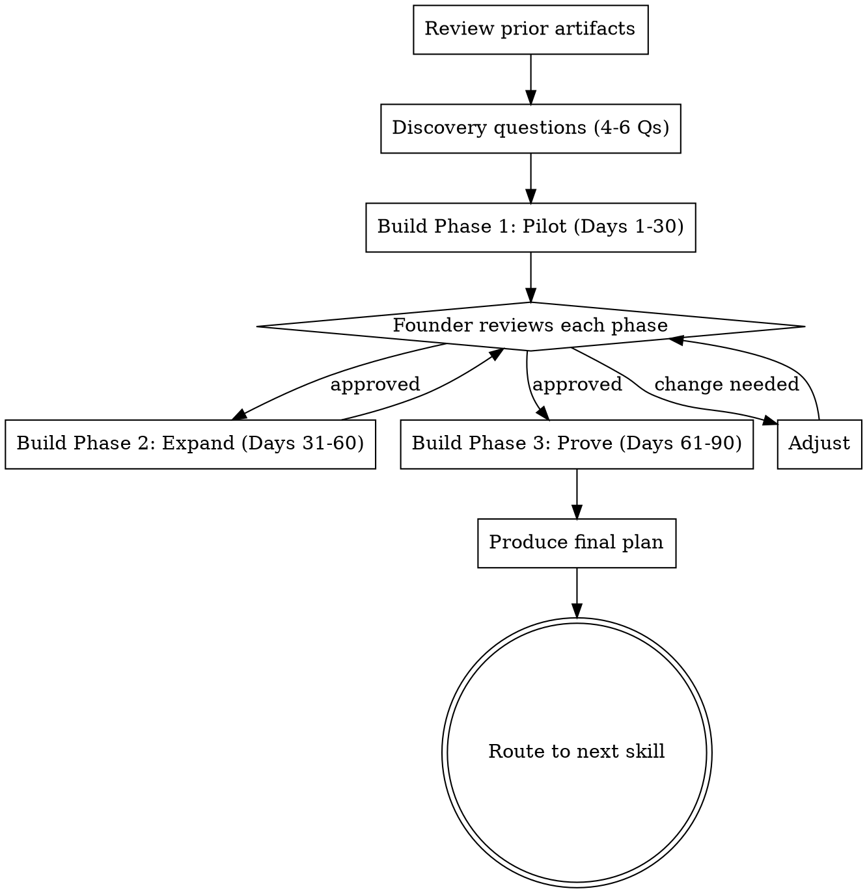

# 90-Day Plan Builder

## Purpose

Builds a phased AI adoption rollout plan with named owners, concrete milestones, and metrics — aligned to the founder's next board meeting. Takes the fluency scorecard, blocker report, and first use case as inputs. Produces a plan the founder can execute and report on.

**Core principle:** A plan without named owners and dates is a wish list. Every action in this plan has a who and a when.

## Flow



## Process

<HARD-GATE>
1. Ask ONE question at a time. Never batch questions.
2. Wait for the founder's actual answer before proceeding.
3. Do NOT rerun the fluency assessment, blocker diagnosis, or use case picker. Reference their outputs.
4. Present each phase for founder approval before building the next.
5. Every action must have a named owner (role, not "the team") and a timeframe (week, not "soon").
</HARD-GATE>

### Step 1: Review Prior Artifacts

Reference the fluency scorecard, blocker report, and use case brief. Summarize what you're building from:

> "Here's what I'm working with from your previous sessions: [scorecard summary], [top blockers], [chosen use case]. I need a few more details to build a plan that actually fits your team."

If prior artifacts are missing, ask the founder to summarize their scores, blockers, and chosen use case before proceeding.

### Step 2: Discovery Questions

You need specifics that the previous skills didn't cover. Ask one at a time:

- **Board timing:** "When is your next board meeting? That's our deadline for having results to show."
- **Champion:** "Who on your team would you put in charge of the pilot? Not you — someone with time and interest."
- **Capacity:** "How many hours per week can the champion realistically dedicate? And how many team members can participate in the pilot without disrupting current work?"
- **Budget:** "Do you have budget flexibility for AI tools, or does anything above a threshold need approval?"
- **Board format:** "When your board asks about engineering initiatives, what format do they expect? Narrative? Slides? Data table?"
- **Prior attempts:** "Has anything been tried before that we need to avoid repeating?"

Skip questions already answered by prior artifacts. Adapt to what you know.

### Planning Principle: Change Defaults, Not People

Don't build a plan that asks people to remember to use AI tools. Build a plan that changes the starting conditions of their work so AI is already there.

**Examples:**

Use the relevant department profile below for department-specific examples. The principle is the same regardless of department: make AI the starting point, not an optional step.

If Phase 1 actions rely on people voluntarily changing habits, the plan will fail. Change the environment, not the people.

### Step 3: Build Phase 1 (Days 1-30) — Pilot

Present Phase 1 to the founder. This phase must:
- Name the adoption champion with explicit time allocation
- Scope the first use case pilot (which team or sub-team, which scope of work, how many participants)
- Set baseline metrics before the pilot starts
- Address the #1 blocker from the blocker report
- Include at least one "change the default" action — something that makes AI the starting point, not an optional add-on
- Define what success looks like at Day 30 — Phase 1 metrics are early signals (are people trying it? how often?), not proof. Don't expect outcome data yet.

**Phase 1 structure:**

| Week | Action | Owner | Done when |
|------|--------|-------|-----------|
| 1 | [Specific action] | [Named role] | [Concrete deliverable] |
| ... | ... | ... | ... |

Present this to the founder: "Here's what Month 1 looks like. Does this feel right, or should we adjust?"

### Step 4: Build Phase 2 (Days 31-60) — Expand

Phase 2 must:
- Expand the pilot based on Phase 1 results
- Address the #2 blocker if not yet resolved
- Begin measuring ROI (hours saved, cost avoided)
- Embed AI into existing team rituals — kickoffs, reviews, decision meetings. If AI outputs aren't welcome in these moments, people stop producing them. AI spreads through rituals, not enthusiasm.
- Start identifying the second use case
- Prepare early board narrative draft

### Step 5: Build Phase 3 (Days 61-90) — Prove and Present

Phase 3 must:
- Consolidate metrics across all use cases
- Calculate ROI in board-ready terms
- Draft the board narrative
- Rehearse hard board questions
- Scope next quarter

### Step 6: Produce Final Plan

After founder approves all three phases, produce the complete plan in the Output format below.

## Anti-Patterns

### The Plan With No Names
**Symptom:** Actions say "the team should..." or "someone needs to..."
**Consequence:** Nobody does it. Same ownership gap that caused the problem.
**Fix:** Every action has a specific role or person. "The adoption champion configures..." not "the tool should be configured..."

### Re-Diagnosing Instead of Planning
**Symptom:** You re-run the fluency assessment or re-analyze blockers inside the plan.
**Consequence:** Wasted time, contradictory findings, founder fatigue.
**Fix:** Reference prior artifacts directly. "Your blocker report identified X. Phase 1 addresses this by..."

### The 50-Item Plan
**Symptom:** Each phase has 15+ action items, risk registers, contingency tables.
**Consequence:** Founder looks at it and does nothing. Too many items = no priorities.
**Fix:** 4-6 actions per phase maximum. If it's more than that, you're over-planning. The founder needs to know what to do this week, not every possible thing that could happen.

### Milestones Without Metrics
**Symptom:** "Expand adoption" or "improve team sentiment" as a milestone.
**Consequence:** No way to know if you hit it. Board can't evaluate progress.
**Fix:** Every milestone has a number. "5 team members using AI tools weekly" not "increase adoption."

### Relying on Voluntary Habit Change
**Symptom:** Every action is "train," "encourage," or "remind" people to use AI tools.
**Consequence:** Adoption depends on willpower. People revert to old habits within weeks.
**Fix:** At least one action per phase must change the default — make AI the starting point for a task, not an optional step people have to remember.

### Planning Around the Blocker Instead of Through It
**Symptom:** The plan avoids the main blocker (e.g., the hostile VP) and works around them.
**Consequence:** Short-term progress, long-term failure. The blocker is still there.
**Fix:** Phase 1 must include a specific action to address the #1 blocker. You can be strategic about it (build proof first, then confront) but you can't ignore it.

## Output

Produce the 90-day plan in this exact format:

```
## 90-Day AI Adoption Plan
**Company:** [name] | **Team:** [size] | **Stage:** [stage] | **Date:** [date]
**Board meeting:** [date or "Day X"]
**Adoption champion:** [name/role] | **Time allocation:** [hours/week]
**First use case:** [name from use case brief]

### Starting Position
- Fluency scores: Psych [X/5] | Integration [X/5] | Ownership [X/5]
- Top blocker: [from blocker report]
- Current state: [one sentence — e.g., "3 of 25 team members use AI tools occasionally"]

### Status Convention (used in each phase below)

Each phase milestone carries a target and a status pill:
- `above plan` — milestone exceeded
- `on plan` — milestone met within ±10%
- `below plan` — milestone missed
- `pilot` — pilot phase, not yet measured against the target
- `measuring` — results present but attribution still being verified

Status reflects against the plan, not against zero. A phase can be "below plan" while still moving the team forward.

### Phase 1: Pilot (Days 1-30)
**Goal:** [One sentence]

| Week | Action | Owner | Done when |
|------|--------|-------|-----------|
| 1 | ... | ... | ... |

**Phase 1 success metric:** [Specific, measurable]
- **Status at Day 30:** [target metric outcome → pick one: `above plan` / `on plan` / `below plan` / `pilot` / `measuring`]

### Phase 2: Expand (Days 31-60)
**Goal:** [One sentence]

| Week | Action | Owner | Done when |
|------|--------|-------|-----------|
| 5 | ... | ... | ... |

**Phase 2 success metric:** [Specific, measurable]
- **Status at Day 60:** [target metric outcome → pick one: `above plan` / `on plan` / `below plan` / `pilot` / `measuring`]

### Phase 3: Prove & Present (Days 61-90)
**Goal:** [One sentence]

| Week | Action | Owner | Done when |
|------|--------|-------|-----------|
| 9 | ... | ... | ... |

**Phase 3 success metric:** [Specific, measurable]
- **Status at Day 90:** [target metric outcome → pick one: `above plan` / `on plan` / `below plan` / `pilot` / `measuring`]

### Board-Ready Numbers (Target for Day 90)
| Metric | Baseline | Target |
|--------|----------|--------|
| [Team role] using AI tools weekly (substitute with the department's role label: engineers / reps / marketers / etc.) | [X] | [Y] |
| [Use-case-specific metric] | [X] | [Y] |
| Estimated hours saved per week | [X] | [Y] |
| Tool cost per month | [CCY][X] | [CCY][Y] |

### What You'll Say to the Board
[3-4 sentence draft narrative the founder can adapt. Specific numbers, not platitudes.]
```

## Next Skill

| Situation | Recommended next skill |
|-----------|----------------------|
| Founder wants to rehearse for the board | `board-narrative-coach` |
| Founder wants to calculate ROI now | `roi-calculator` |
| Founder wants the full adoption cycle | Continue to `board-narrative-coach` (next in the chain) |
| Default | `board-narrative-coach` |

## Department Profiles

### Engineering

**"Change the default" examples:**
- Instead of "train engineers to use AI for code review" → "configure AI review comments to appear automatically on every PR"
- Instead of "encourage engineers to try AI for tests" → "add AI test generation to the PR template checklist"
- Instead of "remind people to use AI for docs" → "change the doc template so the first draft is AI-generated"

### Sales

**"Change the default" examples:**
- Instead of "train reps to use AI for outreach" → "configure AI draft suggestions to appear in the email composer for every new prospect"
- Instead of "encourage CRM updates" → "enable automatic call summary logging — AI writes the note, rep approves with one click"
- Instead of "share best practices" → "add AI-generated meeting prep brief to every calendar invite with a prospect"

### Generic

**"Change the default" examples:**
- Instead of "train the team to use AI for meeting notes" → "configure AI meeting summaries to send automatically to every attendee after the call"
- Instead of "encourage AI use for first drafts" → "embed an AI draft step in the document/template that fires before a human ever opens it"
- Instead of "remind people to use AI for research" → "make the team's research tool a chat assistant that surfaces sources by default"

## References

- `fluency-assessment` — provides the scorecard that frames the starting position
- `blocker-diagnosis` — identifies what Phase 1 must address
- `first-use-case-picker` — defines the use case the plan is built around
- `board-narrative-coach` — most common next step, rehearses and drafts the board update
- `full-adoption-cycle` — orchestrates this skill as the fourth step in the complete sequence
