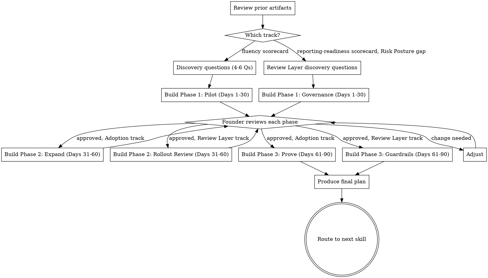

# 90-Day Plan Builder

## Purpose

Builds a phased AI adoption rollout plan with named owners, concrete milestones, and metrics — aligned to the founder's next board meeting. Takes the fluency scorecard, blocker report, and first use case as inputs. Produces a plan the founder can execute and report on.

**Core principle:** A plan without named owners and dates is a wish list. Every action in this plan has a who and a when.

## Context Intake

For `Department:` and `Currency:`, use the first available source: the current fluency scorecard → `adoption.local.md` (the department this run covers; by default the one marked `(primary)` — see CLAUDE.md Local Configuration) → ask the leader (currency defaults to USD).

## Flow


```dot
digraph plan {
    "Review prior artifacts" [shape=box];
    "Which track?" [shape=diamond];
    "Discovery questions (4-6 Qs)" [shape=box];
    "Build Phase 1: Pilot (Days 1-30)" [shape=box];
    "Build Phase 2: Expand (Days 31-60)" [shape=box];
    "Build Phase 3: Prove (Days 61-90)" [shape=box];
    "Review Layer discovery questions" [shape=box];
    "Build Phase 1: Governance (Days 1-30)" [shape=box];
    "Build Phase 2: Rollout Review (Days 31-60)" [shape=box];
    "Build Phase 3: Guardrails (Days 61-90)" [shape=box];
    "Founder reviews each phase" [shape=diamond];
    "Adjust" [shape=box];
    "Produce final plan" [shape=box];
    "Route to next skill" [shape=doublecircle];

    "Review prior artifacts" -> "Which track?";
    "Which track?" -> "Discovery questions (4-6 Qs)" [label="fluency scorecard"];
    "Which track?" -> "Review Layer discovery questions" [label="reporting-readiness scorecard, Risk Posture gap"];
    "Discovery questions (4-6 Qs)" -> "Build Phase 1: Pilot (Days 1-30)";
    "Build Phase 1: Pilot (Days 1-30)" -> "Founder reviews each phase";
    "Review Layer discovery questions" -> "Build Phase 1: Governance (Days 1-30)";
    "Build Phase 1: Governance (Days 1-30)" -> "Founder reviews each phase";
    "Founder reviews each phase" -> "Adjust" [label="change needed"];
    "Founder reviews each phase" -> "Build Phase 2: Expand (Days 31-60)" [label="approved, Adoption track"];
    "Founder reviews each phase" -> "Build Phase 2: Rollout Review (Days 31-60)" [label="approved, Review Layer track"];
    "Adjust" -> "Founder reviews each phase";
    "Build Phase 2: Expand (Days 31-60)" -> "Founder reviews each phase";
    "Build Phase 2: Rollout Review (Days 31-60)" -> "Founder reviews each phase";
    "Founder reviews each phase" -> "Build Phase 3: Prove (Days 61-90)" [label="approved, Adoption track"];
    "Founder reviews each phase" -> "Build Phase 3: Guardrails (Days 61-90)" [label="approved, Review Layer track"];
    "Build Phase 3: Prove (Days 61-90)" -> "Produce final plan";
    "Build Phase 3: Guardrails (Days 61-90)" -> "Produce final plan";
    "Produce final plan" -> "Route to next skill";
}
```

## Process

<HARD-GATE>
1. Ask ONE question at a time. Never batch questions.
2. Wait for the founder's actual answer before proceeding.
3. Do NOT rerun the fluency assessment, blocker diagnosis, or use case picker. Reference their outputs.
4. Present each phase for founder approval before building the next.
5. Every action must have a named owner (role, not "the team") and a timeframe (week, not "soon").
</HARD-GATE>

### Step 1: Review Prior Artifacts and Pick a Track

This skill builds two kinds of plan. Check which artifact the founder is arriving with:

- **Fluency scorecard** (from `fluency-assessment`, plus blocker report and use case brief) → build the **Adoption Track**: continue with Step 2 below (pilot → expand → prove).
- **Reporting-readiness scorecard** (from `reporting-readiness-assessment`) with **Risk Posture as the weak pillar** → build the **Review Layer Track**: skip to the "Review Layer Track" section below instead of Step 2 (governance → rollout review → guardrails).

**For the Adoption Track**, reference the fluency scorecard, blocker report, and use case brief. Summarize what you're building from:

> "Here's what I'm working with from your previous sessions: [scorecard summary], [top blockers], [chosen use case]. I need a few more details to build a plan that actually fits your team."

If prior artifacts are missing, ask the founder to summarize their scores, blockers, and chosen use case before proceeding.

**For the Review Layer Track**, reference the reporting-readiness scorecard. Summarize what you're building from:

> "Here's what I'm working with: your reporting-readiness scorecard shows Risk Posture at [X]/5, and [key finding from the scorecard]. I need a few more details to build a plan that closes that gap."

Then go to the "Review Layer Track" section below instead of continuing to Step 2.

### Step 2: Discovery Questions

You need specifics that the previous skills didn't cover. Ask one at a time:

- **Board timing:** "When is your next board meeting? That's our deadline for having results to show."
- **Champion:** "Who on your team would you put in charge of the pilot? Not you — someone with time and interest."
- **Capacity:** "How many hours per week can the champion realistically dedicate? And how many team members can participate in the pilot without disrupting current work?"
- **Budget:** "Do you have budget flexibility for AI tools, or does anything above a threshold need approval?"
- **Board format:** "When your board asks about engineering initiatives, what format do they expect? Narrative? Slides? Data table?"
- **Prior attempts:** "Has anything been tried before that we need to avoid repeating?"

Skip questions already answered by prior artifacts. Adapt to what you know.

### Planning Principle: Change Defaults, Not People

Don't build a plan that asks people to remember to use AI tools. Build a plan that changes the starting conditions of their work so AI is already there.

**Examples:**

Use the relevant department profile below for department-specific examples. The principle is the same regardless of department: make AI the starting point, not an optional step.

If Phase 1 actions rely on people voluntarily changing habits, the plan will fail. Change the environment, not the people.

### Step 3: Build Phase 1 (Days 1-30) — Pilot

If a `data-readiness-check` surfaced Gap-rated dimensions for this use case, insert a Phase 0 (Days -14 to 0, before the Phase 1 dates below) covering the specific fixes named in that check. Name an owner and a done-when for each fix, same as any other phase action. Phase 1 doesn't start until the named Gap fixes are done.

Present Phase 1 to the founder. This phase must:
- Name the adoption champion with explicit time allocation
- Scope the first use case pilot (which team or sub-team, which scope of work, how many participants)
- Set baseline metrics before the pilot starts
- Address the #1 blocker from the blocker report
- Include at least one "change the default" action — something that makes AI the starting point, not an optional add-on
- Define what success looks like at Day 30 — Phase 1 metrics are early signals (are people trying it? how often?), not proof. Don't expect outcome data yet.

**Phase 1 structure:**

| Week | Action | Owner | Done when |
|------|--------|-------|-----------|
| 1 | [Specific action] | [Named role] | [Concrete deliverable] |
| ... | ... | ... | ... |

Present this to the founder: "Here's what Month 1 looks like. Does this feel right, or should we adjust?"

### Step 4: Build Phase 2 (Days 31-60) — Expand

Phase 2 must:
- Expand the pilot based on Phase 1 results
- Address the #2 blocker if not yet resolved
- Begin measuring ROI (hours saved, cost avoided)
- Embed AI into existing team rituals — kickoffs, reviews, decision meetings. If AI outputs aren't welcome in these moments, people stop producing them. AI spreads through rituals, not enthusiasm.
- Start identifying the second use case
- Prepare early board narrative draft

### Step 5: Build Phase 3 (Days 61-90) — Prove and Present

Phase 3 must:
- Consolidate metrics across all use cases
- Calculate ROI in board-ready terms
- Draft the board narrative
- Rehearse hard board questions
- Scope next quarter

### Step 6: Produce Final Plan

After founder approves all three phases, produce the complete plan in the Output format below.

## Review Layer Track

Use this track instead of Steps 2-6 above when the founder arrives with a `reporting-readiness-assessment` scorecard showing Risk Posture as the weak pillar. Same mechanics as the Adoption Track — phased, named owners, metrics, founder approves each phase before the next — different content.

### Discovery Questions

Ask one at a time. Reuse from the founder's context where already known.

**If an `ai-exposure-register` exists, read it before asking.** Its exceptions list already names the weakest use cases and their owners — Phase 1 covers those exceptions rather than re-deriving them, and each exception's due date becomes a milestone. Skip the "Weakest use case" question and confirm what the register shows instead. If no register exists, build one first — you cannot assign governance owners to use cases nobody has listed.

- **Board timing:** "When is your next board meeting? That's our deadline for having results to show."
- **Governance owner:** "Who would own deciding what 'correct' means for your riskiest AI use case — not you, someone with the authority and time to make that call?"
- **Weakest use case:** "Which of your AI use cases reaches its audience — customer-facing or internal, like a finance report — with zero human review today? That's where Phase 1 starts."
- **Capacity:** "How many hours per week can the governance owner realistically dedicate?"
- **Budget:** "Do you have budget flexibility for review tooling, or does anything above a threshold need approval?"
- **Board format:** "When your board asks about AI risk, what format do they expect? Narrative? Slides? Data table?"
- **Prior attempts:** "Has anything been tried before that we need to avoid repeating?"

### Review Layer Phase 1 (Days 1-30) — Governance

Present Phase 1 to the founder. This phase must:
- Name the governance owner for the highest-risk use case identified in discovery
- Write down what "correct" means for that use case — a definition, not tribal knowledge
- Confirm or assign its risk tier if not already done
- Set a baseline: how many AI outputs — customer-facing or internal — currently ship with zero human review?
- Define what success looks like at Day 30

| Week | Action | Owner | Done when |
|------|--------|-------|-----------|
| 1 | [Specific action] | [Named role] | [Concrete deliverable] |
| ... | ... | ... | ... |

Present this to the founder: "Here's what Month 1 looks like. Does this feel right, or should we adjust?"

### Review Layer Phase 2 (Days 31-60) — Rollout Review

Phase 2 must:
- Build a sign-off step before the target use case's output reaches whoever relies on it — customer or internal team (name who tests, who approves)
- Start an audit/incident log if none exists
- Begin tracking how often the sign-off step actually catches something

### Review Layer Phase 3 (Days 61-90) — Guardrails

Phase 3 must:
- Add a human-review gate for irreversible actions on the target use case (refunds, account changes, outbound messages, financial postings, or similar)
- Build and document a kill switch — a way to turn off the AI feature immediately if it misbehaves
- Start spot-checking reviewer quality
- Consolidate governance + rollout review + guardrails status into a board narrative

### Review Layer Output

After founder approves all three phases, produce the plan in this exact format:

```
## 90-Day Review Layer Plan
**Company:** [name] | **Date:** [date]
**Board meeting:** [date or "Day X"]
**Governance owner:** [name/role] | **Time allocation:** [hours/week]
**Target use case:** [name — the highest-risk use case with the least review today]

### Starting Position
- Reporting-readiness scores: Outcome Rigor [X/5] | Risk Posture [X/5] | Board Defensibility [X/5]
- Current state: [one sentence — e.g., "3 of 8 AI use cases ship to their audience with no human review"]

### Status Convention (used in each phase below)

Each phase milestone carries a target and a status pill:
- `above plan` — milestone exceeded
- `on plan` — milestone met within ±10%
- `below plan` — milestone missed
- `pilot` — pilot phase, not yet measured against the target
- `measuring` — results present but attribution still being verified

Status reflects against the plan, not against zero. A phase can be "below plan" while still moving the team forward.

### Phase 1: Governance (Days 1-30)
**Goal:** [One sentence]

| Week | Action | Owner | Done when |
|------|--------|-------|-----------|
| 1 | ... | ... | ... |

**Phase 1 success metric:** [Specific, measurable]
- **Status at Day 30:** [target metric outcome → pick one: `above plan` / `on plan` / `below plan` / `pilot` / `measuring`]

### Phase 2: Rollout Review (Days 31-60)
**Goal:** [One sentence]

| Week | Action | Owner | Done when |
|------|--------|-------|-----------|
| 5 | ... | ... | ... |

**Phase 2 success metric:** [Specific, measurable]
- **Status at Day 60:** [target metric outcome → pick one: `above plan` / `on plan` / `below plan` / `pilot` / `measuring`]

### Phase 3: Guardrails (Days 61-90)
**Goal:** [One sentence]

| Week | Action | Owner | Done when |
|------|--------|-------|-----------|
| 9 | ... | ... | ... |

**Phase 3 success metric:** [Specific, measurable]
- **Status at Day 90:** [target metric outcome → pick one: `above plan` / `on plan` / `below plan` / `pilot` / `measuring`]

### Board-Ready Numbers (Target for Day 90)
| Metric | Baseline | Target |
|--------|----------|--------|
| High-risk outputs with human sign-off | [X]% | [Y]% |
| Time to pull the kill switch if needed | [X] | [Y] |
| AI incidents caught before reaching whoever relies on it (customer or internal) | [X] | [Y] |

### What You'll Say to the Board
[3-4 sentence draft narrative the founder can adapt. Specific numbers, not platitudes.]

---
*Generated by [AI Adoption Playbook](https://github.com/adimango/ai-adoption-playbook) v1.2.0 on [YYYY-MM-DD]*
```

## Anti-Patterns

### The Plan With No Names
**Symptom:** Actions say "the team should..." or "someone needs to..."
**Consequence:** Nobody does it. Same ownership gap that caused the problem.
**Fix:** Every action has a specific role or person. "The adoption champion configures..." not "the tool should be configured..."

### Re-Diagnosing Instead of Planning
**Symptom:** You re-run the fluency assessment or re-analyze blockers inside the plan.
**Consequence:** Wasted time, contradictory findings, founder fatigue.
**Fix:** Reference prior artifacts directly. "Your blocker report identified X. Phase 1 addresses this by..."

### The 50-Item Plan
**Symptom:** Each phase has 15+ action items, risk registers, contingency tables.
**Consequence:** Founder looks at it and does nothing. Too many items = no priorities.
**Fix:** 4-6 actions per phase maximum. If it's more than that, you're over-planning. The founder needs to know what to do this week, not every possible thing that could happen.

### Milestones Without Metrics
**Symptom:** "Expand adoption" or "improve team sentiment" as a milestone.
**Consequence:** No way to know if you hit it. Board can't evaluate progress.
**Fix:** Every milestone has a number. "5 team members using AI tools weekly" not "increase adoption."

### Relying on Voluntary Habit Change
**Symptom:** Every action is "train," "encourage," or "remind" people to use AI tools.
**Consequence:** Adoption depends on willpower. People revert to old habits within weeks.
**Fix:** At least one action per phase must change the default — make AI the starting point for a task, not an optional step people have to remember.

### Planning Around the Blocker Instead of Through It
**Symptom:** The plan avoids the main blocker (e.g., the hostile VP) and works around them.
**Consequence:** Short-term progress, long-term failure. The blocker is still there.
**Fix:** Phase 1 must include a specific action to address the #1 blocker. You can be strategic about it (build proof first, then confront) but you can't ignore it.

## Output

Produce the 90-day plan in this exact format:

```
## 90-Day AI Adoption Plan
**Company:** [name] | **Team:** [size] | **Stage:** [stage] | **Date:** [date]
**Board meeting:** [date or "Day X"]
**Adoption champion:** [name/role] | **Time allocation:** [hours/week]
**First use case:** [name from use case brief]

### Starting Position
- Fluency scores: Psych [X/5] | Integration [X/5] | Ownership [X/5]
- Top blocker: [from blocker report]
- Current state: [one sentence — e.g., "3 of 25 team members use AI tools occasionally"]

### Status Convention (used in each phase below)

Each phase milestone carries a target and a status pill:
- `above plan` — milestone exceeded
- `on plan` — milestone met within ±10%
- `below plan` — milestone missed
- `pilot` — pilot phase, not yet measured against the target
- `measuring` — results present but attribution still being verified

Status reflects against the plan, not against zero. A phase can be "below plan" while still moving the team forward.

### Phase 1: Pilot (Days 1-30)
**Goal:** [One sentence]

| Week | Action | Owner | Done when |
|------|--------|-------|-----------|
| 1 | ... | ... | ... |

**Phase 1 success metric:** [Specific, measurable]
- **Status at Day 30:** [target metric outcome → pick one: `above plan` / `on plan` / `below plan` / `pilot` / `measuring`]

### Phase 2: Expand (Days 31-60)
**Goal:** [One sentence]

| Week | Action | Owner | Done when |
|------|--------|-------|-----------|
| 5 | ... | ... | ... |

**Phase 2 success metric:** [Specific, measurable]
- **Status at Day 60:** [target metric outcome → pick one: `above plan` / `on plan` / `below plan` / `pilot` / `measuring`]

### Phase 3: Prove & Present (Days 61-90)
**Goal:** [One sentence]

| Week | Action | Owner | Done when |
|------|--------|-------|-----------|
| 9 | ... | ... | ... |

**Phase 3 success metric:** [Specific, measurable]
- **Status at Day 90:** [target metric outcome → pick one: `above plan` / `on plan` / `below plan` / `pilot` / `measuring`]

### Board-Ready Numbers (Target for Day 90)
| Metric | Baseline | Target |
|--------|----------|--------|
| [Team role] using AI tools weekly (substitute with the department's role label: engineers / reps / marketers / etc.) | [X] | [Y] |
| [Use-case-specific metric] | [X] | [Y] |
| Estimated hours saved per week | [X] | [Y] |
| Tool cost per month | [CCY][X] | [CCY][Y] |

### What You'll Say to the Board
[3-4 sentence draft narrative the founder can adapt. Specific numbers, not platitudes.]

---
*Generated by [AI Adoption Playbook](https://github.com/adimango/ai-adoption-playbook) v1.2.0 on [YYYY-MM-DD]*
```

## Next Skill

| Situation | Recommended next skill |
|-----------|----------------------|
| Founder wants to rehearse for the board | `board-narrative-coach` |
| Founder wants to calculate ROI now | `roi-calculator` |
| Founder wants the full adoption cycle | Continue to `board-narrative-coach` (next in the chain) |
| Default | `board-narrative-coach` |

## Department Profiles

### Engineering

**"Change the default" examples:**
- Instead of "train engineers to use AI for code review" → "configure AI review comments to appear automatically on every PR"
- Instead of "encourage engineers to try AI for tests" → "add AI test generation to the PR template checklist"
- Instead of "remind people to use AI for docs" → "change the doc template so the first draft is AI-generated"

### Sales

**"Change the default" examples:**
- Instead of "train reps to use AI for outreach" → "configure AI draft suggestions to appear in the email composer for every new prospect"
- Instead of "encourage CRM updates" → "enable automatic call summary logging — AI writes the note, rep approves with one click"
- Instead of "share best practices" → "add AI-generated meeting prep brief to every calendar invite with a prospect"

### Generic

**"Change the default" examples:**
- Instead of "train the team to use AI for meeting notes" → "configure AI meeting summaries to send automatically to every attendee after the call"
- Instead of "encourage AI use for first drafts" → "embed an AI draft step in the document/template that fires before a human ever opens it"
- Instead of "remind people to use AI for research" → "make the team's research tool a chat assistant that surfaces sources by default"

## References

- `fluency-assessment` — provides the scorecard that frames the starting position (Adoption Track)
- `blocker-diagnosis` — identifies what Phase 1 must address (Adoption Track)
- `first-use-case-picker` — defines the use case the plan is built around (Adoption Track)
- `data-readiness-check` — provides the verdict that triggers an optional Phase 0 (Adoption Track), when Gap-rated dimensions exist
- `reporting-readiness-assessment` — provides the scorecard that triggers the Review Layer Track, when Risk Posture is the weak pillar
- `ai-exposure-register` — runs before the Review Layer Track; its exceptions list seeds Phase 1 governance with named owners and due dates
- `board-narrative-coach` — most common next step, rehearses and drafts the board update
- `full-adoption-cycle` — orchestrates this skill as the fifth step in the complete sequence (Adoption Track)
