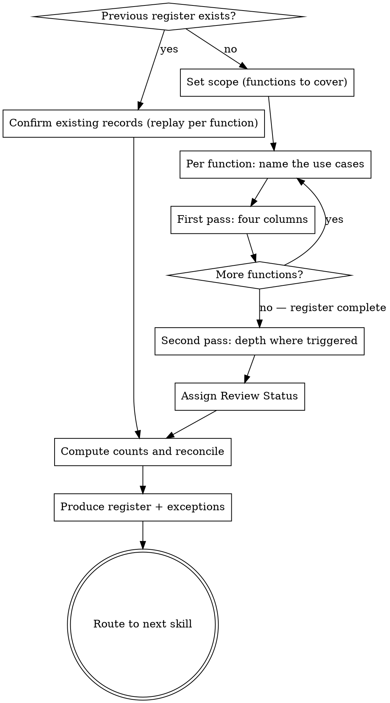

# AI Exposure Register

## Purpose

Collects one record per AI use case actually running in the company — what it does, who owns it, what data it reads, and whether it can act on its own. Produces the exposure section of the board report: four counts, a per-function rollup, and an exceptions list with named owners and due dates.

This is the missing input to a question the framework already asks. `reporting-readiness-assessment` Risk Posture Q4 asks how AI use cases are classified by risk tier, and Q5 asks about EU AI Act readiness. Neither can be answered honestly without a list of use cases, and no other skill produces one. Without this register, Risk Posture is an opinion about a register that does not exist.

**Core principle:** Ask about behaviour, not capability. A leader cannot reliably answer "can it write to your CRM?" They can answer "when it finishes, does something appear in HubSpot on its own, or do you click something first?" Capability questions get guesses. Behavioural questions get facts.

**Four columns, a minute per entry.** The register is four things: what it is, who owns it, whether it can act without a person, and what data it touches. That is the whole first pass, and it is a complete deliverable — not a draft. Six more fields exist, but they are only collected for the handful of records that earn them.

This staging is the design, not a shortcut. People abandon inventories halfway. A four-column register covering the whole company beats a ten-field one that stopped at Engineering, and the second is what you get if you ask everything about everything.

**This register observes. It does not restrict.** The speed advantage smaller companies have comes from people being able to wire up what they need without raising a ticket. Permissions and monitoring exist on most of these platforms, but they are hard to run well, and tightening them is the fastest way to remove what made the company quick. The register's job is to make the exposure visible and give the sharp cases a name and a date — not to become a gate. Read the output as a short, targeted exception list, never as an argument for locking the platform down.

**Which pillar this serves:** Ownership Gaps. The register's most common finding is a use case with no named owner — which is the Ownership Gaps pillar stated as a fact rather than a score. Every `action needed` record is an ownership gap with a name and a date attached to it.

**Why you have to ask instead of scan.** Device management shows what software is installed. Discovery tools go further and match logins and app usage to surface AI nobody approved. Both are useful. Both mostly see applications.

These use cases sit one layer below that. CV screening switched on inside the HR system. Something in finance built to review invoices. A prospecting agent inside the CRM. No new app, no new login, nothing installed — there was never a moment when anyone had to write them down. A scan of installed software cannot see them, so you ask the people who turned them on.

**Important:** This register is self-declared, never discovered. It records what people told you, not what a scan found. Every output carries a last-confirmed date. Overstating what the register knows is the exact failure mode this playbook exists to prevent.

**What this method cannot do.** Asking scales to teams, not to people. You can ask ten team leads. You cannot ask a thousand employees, and nothing in this skill pretends otherwise. Larger companies are not better covered — they usually have more tools and therefore assume they are, which is the same gap with more surface. Say this out loud to the leader rather than letting the register imply completeness it does not have.

## Context Intake

> Unfamiliar `~~category` placeholders? See [CONNECTORS.md](../../CONNECTORS.md) for connected-tool categories.

For `Department:`, use the first available source: the current fluency scorecard → `adoption.local.md` (the department this run covers; by default the one marked `(primary)` — see CLAUDE.md Local Configuration) → ask the leader. This skill records no money, so it does not read `Currency:`.

This register is the one skill that runs **across** functions rather than within one. If `adoption.local.md` lists several departments or `whole org`, cover all of them in a single register — the per-function rollup is the point. Use `Department:` only to decide which Department Profile prompts to lean on first.

If a previous register exists (from `adoption.local.md`, a prior run, or `~~cloud storage`), load it and run the confirmation loop rather than re-collecting from scratch: replay the list per function, ask only what changed, and re-date what is confirmed. `quarterly-review` Step 2 describes that loop in full — run it inline here when the leader only wants the register refreshed. Do not send them to `quarterly-review` for this: that skill requires a previous fluency scorecard, which a standalone register run will not have.

**This skill may run standalone**, without a prior `fluency-assessment`. It is the documented exception to the fluency-first chaining rule: the register is useful before any assessment, and gating it kills adoption.

## Flow



## Process

<HARD-GATE>
1. Ask about behaviour, never capability. Never ask "can it access X" or "does it have permission to Y." Ask what the person observes happening.
2. Every record needs a named person as Owner. Not a team, not a department, not "IT." If no name exists, the record is logged with Owner blank and Review Status `action needed` — never silently assigned.
3. Nothing enters the adoption count without a named owner AND evidence of sustained use (a user count and a frequency). A tool someone tried twice is not adoption. Otherwise the register measures enthusiasm.
4. The output must state that the register is self-declared, not discovered, and must carry a last-confirmed date. No exceptions, no softening.
5. Counts must reconcile. The active total equals the sum of the per-function active column; the attention total equals the sum of the attention column. If they do not reconcile, say so rather than printing both.
6. Do NOT assign risk tiers or make EU AI Act determinations. This skill collects the facts those judgments need. Classification is `reporting-readiness-assessment`'s job, and a legal determination is counsel's.
7. Four columns on the first pass, for every record, across every function in scope. Do not go deep on record one. Depth is a second pass over the records that trip a trigger in Step 4 — a register nobody finishes is worse than a short one, and going deep early is how runs get abandoned.
8. Never present the "can take actions" count as the risk ranking. It measures autonomy, not consequence. The exceptions list is the risk ranking, and the "What This Means" paragraph must name the highest-consequence record whether or not it has `acts` authority.
</HARD-GATE>

### Step 1: Set Scope

> "I'm going to list the AI running in the company — four things per entry: what it is, who owns it, whether it can act on its own, and what data it touches. About a minute each. We'll go one function at a time, and we only dig deeper on the few that need it. Which functions should I cover?"

Get the list of functions (Engineering, Sales, Marketing, Support, Finance, HR, Ops, Legal). Work through them one at a time. If the leader cannot speak for a function, note it as **not covered** in the output — an uncovered function is a finding, not a blank.

### Step 2: Name the Use Cases in One Function

> "For [function] — what AI tools or features are people actually using? Include anything built in-house, anything embedded in a tool you already pay for, and anything someone set up themselves."

Prompt for the ones leaders routinely forget:
- AI features switched on inside existing SaaS (the CRM's summarizer, the helpdesk's suggested-reply, the meeting recorder)
- Personal accounts people use for work
- Things a team built with an API key and never told anyone about
- Anything that runs on a schedule rather than when a person clicks

Ask one at a time. Do not let the leader batch a vague list — "we use ChatGPT" is one answer covering six use cases.

#### One vendor is not one use case

Assume every tool the company pays for ships agents, and that those agents reach outward. A vendor row is a container, not a use case. From the outside it is one login; inside there may be forty assistants with different data and different audiences.

**On the first pass, ask one extra question and move on:** "Has anyone connected it to another system, or shared something they built in it with the team?"

- **No** → one row for the tool. Done.
- **Yes** → one row for the tool, plus a row for each connected or shared thing. You will detail those in Step 4; do not chase them now.

A rollout to 200 people is a capability grant, not a use case — record it as its own row named for what it is ("company-wide assistant rollout"), with the seat count in Users. Never let that row stand in for what people built inside it. "1 active use case" for a company where 200 people can build agents is the most misleading row a register can contain.

### Step 3: First Pass — Four Columns

For every use case in every function in scope. One at a time, options read aloud where the answer is closed. Target a minute per record.

| # | Column | Ask |
|---|--------|-----|
| 1 | **What it is** | Name and one sentence. The use case, not the vendor — "AI-drafted renewal emails," not "ChatGPT." |
| 2 | **Owner** | "Who is the one person you'd call if this produced a bad output tomorrow?" A name, not a team. |
| 3 | **Authority** | `reads only` / `drafts` / `acts` — see below. Ask what happens, never what it can do. |
| 4 | **Reads** | `public` / `internal` / `customer` / `employee` / `applicant` / `financial`. All that apply. |

Also stamp **Function** and **Last confirmed** — both are free, neither needs a question.

Finish every function before going deeper on anything. A complete four-column register is the deliverable; Step 4 is a refinement of it.

#### Authority — ask what happens, not what it can do

| Level | Ask | Record when |
|-------|-----|-------------|
| `reads only` | "When it finishes, what do you get — something you read, or something that's already been sent?" | Output is read by a person; nothing changes in another system |
| `drafts` | "Does it land in a draft or a queue, and someone clicks send or approve?" | A person reviews each output before it takes effect |
| `acts` | "Does anything appear, send, update, or get paid without someone clicking first?" | It sends, posts, writes to a system, or moves money on its own |

Two calls respondents get wrong:

- **Inline assistants are `drafts`, not `reads only`.** A coding assistant suggesting into the editor produces work a person accepts into a real artifact. `reads only` means the output never enters another system at all.
- **Anything on a schedule, or "it just syncs," is `acts`** until proven otherwise. If the leader is unsure, record `acts` — uncertainty about autonomy is itself the finding.

`customer`, `employee`, and `applicant` are personal data. `applicant` is separate because hiring carries the sharpest regulatory exposure and it hides inside "we use AI for recruiting."

**Authority measures autonomy, not consequence.** A bot posting PR comments is `acts` and nearly harmless. A resume screener a human reviews is `reads only` and is the sharpest exposure in most registers. The `acts` count is never the risk ranking.

### Step 4: Second Pass — Only Where It Earns It

Go back over the register and pull out the records that trip any of these:

- Authority is `acts`
- Reads includes `customer`, `employee`, or `applicant`
- Owner is blank
- It is a capability grant, or something built inside one

Usually a handful out of forty. Only for those, collect the remaining six fields and ask the deeper questions:

| Field | What to ask |
|---|---|
| **Vendor / platform** | The product behind it, or "built in-house." |
| **Status** | Pilot / in production / retired. `retired` means switched off — if nobody uses it but it still runs, that is `in production` with `action needed`. |
| **Users** | Count, frequency, and the source. "Seat report, or estimate?" An estimate makes the record `review due`. |
| **Reach beyond its own tool** | "Does it only see what's inside [tool], or has someone connected it to other systems?" An agent in the CRM wired to the shared drive has the reach of both. Record the reach, not the tool. |
| **Where the action lands** | For `acts` only: "Where does that land — inside [tool] or somewhere else?" Crossing a tool boundary is a sharper exposure than staying inside one. Note the destination in the description; that phrase is often the whole finding. |
| **Whose key it runs on** | For things built inside a platform: a key someone added themselves means spend and data under an agreement the company did not sign. An ownership fact, not a violation — note it against Owner. |

**Function, when it spans.** An agent in the CRM that writes to a finance system belongs to the function that owns the data it touches, not the tool it lives in. Assigning by tool is what makes the per-function rollup lie.

**Platform breakout.** Inside a capability grant, give a separate record to anything that has an integration connected, is shared beyond its creator, touches personal data, or runs on a self-added key. Everything else stays as a count on the grant row — "plus roughly 30 personal assistants, no integrations, not shared."

### Step 5: Assign Review Status

Three states. This is a **maintenance** status — it says whether the record is trustworthy.

| Status | Use when |
|--------|----------|
| `verified` | An accountable owner confirmed this record this quarter |
| `review due` | Something material changed, or the record is older than the 90-day review window. A capability-grant row is `review due` at 90 days no matter what, and its list of use cases is assumed incomplete between confirmations — a fixed-function tool changes when someone changes it, a create-capable platform changes when anyone does anything |
| `action needed` | No owner; or `acts` authority combined with personal data and no documented approval; or the output materially affects a person's access to a job, credit, housing, or a service — regardless of Authority level |

**This is not the same as the Outcome Status in `board-ai-update`.** That convention has five states (`above plan` / `on plan` / `below plan` / `pilot` / `measuring`) and describes performance against a plan. This one has three and describes whether the record is current. A use case can be `above plan` and `action needed` at the same time. Never substitute one for the other, and never merge them into a single column.

### Step 6: Compute the Counts and Reconcile

Four counts. These are the report's stat row:

- **Active use cases** — Status is pilot or in production (retired excluded)
- **Need attention** — Review Status is `review due` or `action needed`
- **Can take actions** — Authority is `acts`
- **Touch personal data** — Reads includes customer, employee, or applicant

Then reconcile against the per-function rollup per HARD-GATE 5. If the totals disagree, print the discrepancy instead of both numbers.

### Step 7: Build the Exceptions List

Every record with Review Status `action needed`, plus any `review due` record older than 180 days. Each exception gets a named owner and a due date. An exception without both is not an exception — it is a complaint.

Produce the Output below, then route per the Next Skill table.

## Anti-Patterns

### Capability Questions
**Symptom:** "Does it have write access to Salesforce?" "Can it read the HR drive?"
**Consequence:** Non-technical respondents guess, and they guess low. The register under-reports autonomy exactly where it matters most.
**Fix:** Ask what the person observes. "When it's done, does something appear in Salesforce on its own, or do you click something first?"

### The Discovered Register
**Symptom:** Presenting the register as a complete inventory of AI in the company.
**Consequence:** The board believes the list is exhaustive. It never is — shadow usage is precisely what self-declaration misses. One surprise later destroys trust in every number in the report.
**Fix:** Label it self-declared, carry the last-confirmed date, and name uncovered functions explicitly. State the limit plainly: this covers the teams you asked, at the moment you asked them. Doing it once still surfaces the gaps — usually the same one, something that can act, touching data that matters, with nobody's name against it.

### The Enthusiasm Register
**Symptom:** Counting every tool anyone has ever opened as an active use case.
**Consequence:** The active count inflates, adoption looks strong, and the next quarter's number drops for no visible reason.
**Fix:** A record enters the active count only with a named owner and evidence of sustained use — a user count and a frequency.

### Team as Owner
**Symptom:** Owner reads "Engineering," "the data team," or "IT."
**Consequence:** Nobody confirms the record next quarter and no exception ever gets closed.
**Fix:** Push for a name. If no name exists, that is the finding — leave Owner blank and mark the record `action needed`.

### Autonomy Read as Risk
**Symptom:** The board sees "7 can take actions" and treats it as the list of things to worry about.
**Consequence:** Attention goes to comment-posting bots while an unowned applicant screener — `reads only`, and the most consequential record in the register — goes unexamined.
**Fix:** Report the `acts` count as what it is: how much runs unattended. Put consequence in the exceptions list and name the sharpest record explicitly in "What This Means."

### The Lockdown Response
**Symptom:** The register surfaces user-built assistants and self-added keys, and the recommendation becomes "restrict who can connect integrations."
**Consequence:** You remove the thing that made the company fast. Worse, the next register gets answered dishonestly — people who watched the last one produce a clampdown will not tell you what they built this time.
**Fix:** The register observes; it does not restrict. Name owners, surface the specific records that act unattended or touch personal data, and fix those. Keep the exception list short and targeted. Flexibility is the asset you are protecting, not the problem you are solving.

### Register as Risk Assessment
**Symptom:** The skill starts assigning risk tiers, or declaring use cases high-risk under the EU AI Act.
**Consequence:** The playbook makes a legal determination it has no standing to make, and the leader takes it to the board.
**Fix:** Collect the facts. Hand them to `reporting-readiness-assessment` for classification and to counsel for determination.

### The Hundred-Field Register
**Symptom:** Adding model versions, contract dates, cost centres, and DPIA references as they come up.
**Consequence:** The register never gets finished, and an unfinished register is worth nothing.
**Fix:** Ten fields. Note the extra detail somewhere else and move on.

## Output

Produce the register in this exact format:

```
## AI Exposure Register
**Company:** [name] | **Scope:** [functions covered] | **Date:** [date]

*Self-declared, not discovered. Records reflect what owners reported as of the last-confirmed dates below. Functions not covered: [list, or "none"].*

### Exposure at a Glance

| Active use cases | Need attention | Can take actions | Touch personal data |
|:---:|:---:|:---:|:---:|
| [n] | [n] | [n] | [n] |

### By Function

| Function | Active | Attention | Key exposure | Review status |
|---|:---:|:---:|---|---|
| [function] | [n] | [n] | [one phrase — the sharpest exposure in this function] | [n verified / n review due / n action needed] |
| **Total** | **[n]** | **[n]** | | |

### Register

Four columns, every use case, every function in scope.

| Use case | Owner | Authority | Reads | Function | Last confirmed |
|---|---|---|---|---|---|
| [name — one sentence] | [name] | reads only / drafts / acts | [reach] | [function] | [YYYY-MM-DD] |

### Detail — Flagged Records Only

[Only the records that tripped a Step 4 trigger. If none did, omit this table.]

| Use case | Vendor | Status | Users | Reach beyond tool | Action lands | Key |
|---|---|---|---|---|---|---|
| [name] | [vendor or in-house] | pilot / in production / retired | [n, frequency (source)] | [systems] | [destination, `acts` only] | [company / self-added] |

### Exceptions

| Exception | Use case | Owner | Due |
|---|---|---|---|
| [what is wrong in one phrase] | [name] | [name] | [YYYY-MM-DD] |

### What This Means
[2-3 sentences. The sharpest exposure by consequence — not necessarily the one with `acts` authority — the count that should worry them, and the one thing to fix first.]

---
*Generated by [AI Adoption Playbook](https://github.com/adimango/ai-adoption-playbook) v1.2.0 on [YYYY-MM-DD]*
```

If the counts do not reconcile, replace the stat row with a one-line statement of the discrepancy and what needs re-checking. Do not print two conflicting totals.

Past roughly ten records the Register table stops being readable. Split it into one table per function, same columns, under `#### [Function]` subheadings. The stat row, the per-function rollup, and the exceptions list never split.

## Next Skill

| Situation | Recommended next skill | Why |
|---|---|---|
| Arrived from a Risk Posture gap | `90-day-plan-builder` (Review Layer track) | The register surfaced what governance has to cover — now assign owners and dates |
| Ran standalone, no fluency assessment yet | `fluency-assessment` | You know your exposure; now find out where adoption actually stands |
| Register is clean, board update due | `board-ai-update` | Feeds the AI Exposure and Governance section |
| Risk Posture never scored | `reporting-readiness-assessment` | The register is the evidence Q4 and Q5 need |

> "Your register shows [n] active use cases, [n] needing attention. I'd recommend running [skill name] next to [one sentence]. Want to do that now?"

## Department Profiles

Use the relevant profile to prompt for use cases leaders forget to mention.

### Engineering

**Commonly found:** coding assistants, AI code review, test generation, PR summaries, log/incident triage, doc generation, agents wired to CI.
**Commonly missed:** API keys in scripts nobody owns, AI features inside the observability or ticketing tool, anything a team built on a weekend.
**Watch for:** `acts` authority arriving quietly — a bot that merges, deploys, closes tickets, or files issues on its own.

### Sales

**Commonly found:** prospecting drafts, meeting recorders, CRM auto-update, proposal drafts, pipeline scoring, call coaching.
**Commonly missed:** AI features already bundled in the CRM or sales-engagement tool, reps using personal accounts on customer data.
**Watch for:** `customer` data reach almost everywhere, and `acts` when the meeting recorder writes to the CRM without review.

### Generic

**Commonly found:** drafting, summarization, research, translation, data analysis, chat assistants in the productivity suite.
**Commonly missed:** HR screening tools (`applicant` reach — highest regulatory exposure), finance reconciliation helpers, anything running on a schedule, and assistants people built inside an AI workspace — one vendor, many use cases.
**Watch for:** personal-account usage on internal documents, and scheduled jobs nobody remembers setting up.

## References

- `reporting-readiness-assessment` — routes here on a Risk Posture gap; this register is the evidence its Q4 and Q5 need
- `90-day-plan-builder` — Review Layer track receives the exceptions list and assigns owners and dates
- `board-ai-update` — consumes the counts, the per-function rollup, and the exceptions for its AI Exposure and Governance section
- `quarterly-review` — re-confirms the register each quarter; records unconfirmed for 90 days are reported as unverified
- `tool-stack-audit` — adjacent but different: that skill asks what you pay for and whether it gets used; this one asks what is running and who is accountable
