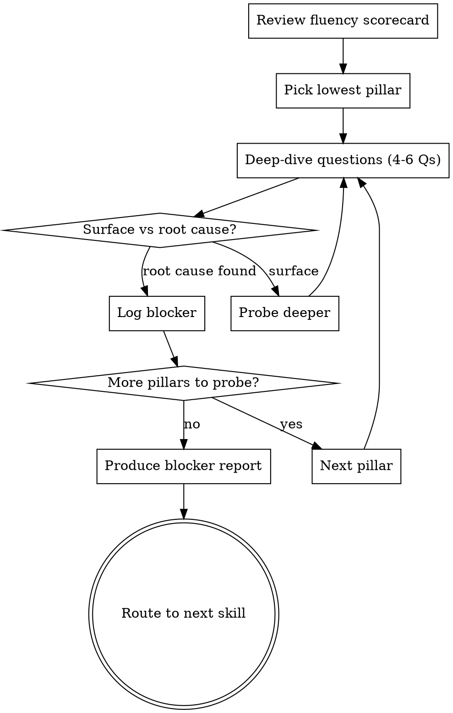

# Blocker Diagnosis

## Purpose

Deep-dive diagnostic that identifies the specific blockers preventing AI adoption, maps each to a pillar, and distinguishes surface complaints from root causes. Chains from fluency-assessment when scores are low. Produces a structured blocker report — not an action plan.

**Core principle:** Name the real blocker, not the excuse. "It doesn't work" is never the real answer. This skill digs until it finds what's actually stuck.

## Flow



## Process

<HARD-GATE>
1. Ask ONE question at a time. Never batch questions.
2. Wait for the founder's actual answer before proceeding. Never simulate or assume answers.
3. Do NOT give solutions, action plans, or recommendations during the diagnosis. Diagnose only.
4. Do NOT suggest tools, hires, or processes. That comes from other skills.
5. Always probe beneath the first answer. The first answer is almost never the root cause.
</HARD-GATE>

### Step 1: Review the Scorecard

Start by confirming the fluency assessment results. If the founder has scores, reference them. If not, ask for a quick summary of where they think things stand.

> "Let's dig into what's actually blocking your team. I'll focus on the areas where your fluency scores are lowest and try to find the specific root causes — not just symptoms. A few pointed questions per area. At the end you'll get a blocker report that names exactly what's stuck and why."

### Step 2: Probe the Lowest Pillar First

Start with the worst-scoring pillar. Ask questions that force specifics and go beneath surface answers.

#### Probing Psychological Barriers

Goal: distinguish identity threat, fear of replacement, perfectionism, and social dynamics.

**Key questions (ask one at a time, adapt based on answers):**
- Who on your team actively avoids AI tools? What's their role and seniority?
- When they explain why they don't use them, what do they actually say? (Get exact words if possible)
- Do senior and junior team members behave differently around AI tools?
- Has anyone on the team — even jokingly — said something about AI replacing them?
- How do your managers talk about AI tools? Do they use them themselves?

**Four signals people are quietly disengaging (probe for all of these):**

| Signal | What it means | Probe with |
|--------|--------------|------------|
| They don't know where to start | No clear first task for AI | "When someone opens the tool, do they know what to use it for? Or do they stare at a blank prompt?" |
| No early wins | Effort felt wasted | "Has anyone on the team had a moment where AI clearly saved them real time? Can you name it?" |
| Effort feels bigger than the payoff | Tool is more work than it saves | "Are people spending more time wrestling with AI output than the original task would take?" |
| It feels like homework | Mandate without motivation | "Did people ask for AI tools, or were they told to use them?" |

If the founder confirms two or more of these, the team hasn't found its entry point yet. This is a setup problem, not a people problem.

**Digging beneath surface answers:**

Use the relevant department profile below for department-specific "what they say / what it means" probes.

**Note:** Not all resistance is irrational. Some people are right that certain tasks need human judgment — trade-offs, accountability, risk calls, context AI can't see. When you find this, name it as a strength, not a blocker. The goal is clarity on where AI helps and where humans must stay, not AI everywhere.

#### Probing Integration Failures

Goal: distinguish tool-workflow mismatch, wrong use case, friction, and premature abandonment.

**Key questions:**
- Walk me through a specific time someone tried an AI tool and stopped. What happened?
- How long did they try before deciding it didn't work?
- Did anyone configure the tool for your team's specific context, or was it out-of-the-box?
- Where in your team's workflow would saving 30 minutes matter most?
- Is there a task your team hates doing that happens every week?

**Variation confusion (a hidden adoption killer):**

People stop using AI when they can't explain why results change. One day the output is great, next day it's useless — and they don't know what they did differently. Probe for this:

- "When people say results are inconsistent, can they explain what changed between the good output and the bad one?"
- "Does anyone on the team understand the difference between a vague prompt and a specific one? Or does it feel random?"

If the team can't explain variation, they'll conclude the tool is unreliable and stop. This is a fixable knowledge gap, not a tool problem.

**Digging beneath surface answers:**

Use the relevant department profile below for department-specific integration probes.

#### Probing Ownership Gaps

Goal: find out who (if anyone) is driving adoption and what measurement exists.

**Key questions:**
- When something goes wrong with AI tool adoption, who hears about it?
- If I asked you right now how many people used an AI tool this week, could you tell me?
- Has anyone set a goal like "X people using Y tool by Z date"?
- Who would you call the AI adoption champion on your team? (Listen for silence or "me, I guess")

**Digging beneath surface answers:**

| They say | It sounds like | Probe with |
|----------|---------------|------------|
| "I own it" (CTO/founder) | No real owner — it's a side project | "How many hours per week do you spend on this? What else competes for that time?" |
| "We'll get to it" | No timeline, no urgency | "What would trigger you to make this a priority?" |
| "Everyone owns it" | Nobody owns it | "Who specifically follows up when someone stops using a tool?" |
| Names someone | Maybe real, maybe nominal | "What's their mandate? Do they have dedicated time?" |

### Step 3: Identify Root Causes

As you probe, classify what you're finding. Every blocker has a surface complaint and a root cause:

| Surface complaint | Possible root causes |
|-------------------|---------------------|
| "The tool isn't good enough" | Identity threat, premature abandonment, wrong use case, no configuration |
| "We don't have time" | No permission from leadership, not prioritized, no owner |
| "It doesn't fit our workflow" | No integration effort, wrong entry point, too much friction |
| "People aren't interested" | Fear, no visible wins, leadership sends mixed signals |
| "We'll do it later" | No owner, no urgency, no accountability |

### Step 4: Probe Secondary Pillars

After diagnosing the lowest pillar, briefly probe the other two. Some blockers cross pillars — a VP who calls AI tools "overhyped" is both a psychological barrier (social signal) and an ownership gap (leadership misalignment).

Keep secondary probes shorter: 2-3 questions per pillar, focused on the most likely issues given what you've already learned.

## Anti-Patterns

### Accepting the First Answer
**Symptom:** Founder says "they think AI code isn't good enough" and you log it as the blocker.
**Consequence:** You're documenting the excuse, not the cause.
**Fix:** Always ask the follow-up. "Did they show you examples? How long did they try? What specifically wasn't good enough?" The root cause is usually 2-3 questions deeper.

### Diagnosing and Prescribing Simultaneously
**Symptom:** You identify a blocker and immediately suggest a fix.
**Consequence:** Founder anchors on the first solution you mention. You haven't finished diagnosing.
**Fix:** Complete the full diagnosis across all relevant pillars before any mention of next steps. The blocker report names problems. Other skills solve them.

### Treating Everything as Psychological
**Symptom:** You assume all resistance is fear or identity-based.
**Consequence:** You miss legitimate tool-workflow mismatches. Some tools genuinely don't fit.
**Fix:** When someone says "it doesn't work," probe whether they configured it, how long they tried, and what specifically failed. If the answer is "I set it up properly, used it for 3 weeks on real work, and it consistently produced wrong suggestions for our Scala backend" — that's integration, not psychology.

### Letting the Founder Self-Diagnose
**Symptom:** Founder says "our problem is ownership" and you agree without probing.
**Consequence:** Founders often misidentify the pillar. They see the symptom closest to them.
**Fix:** "You might be right, but let me verify. Tell me about..." and probe all three pillars.

## Output

After all probing, produce the blocker report in this exact format:

```
## Blocker Report
**Company:** [name] | **Date:** [date]
**Fluency scores:** Psych [X/5] | Integration [X/5] | Ownership [X/5]

### Blockers Found

#### Blocker 1: [Name — short, specific]
- **Pillar:** [Psychological / Integration / Ownership]
- **Surface complaint:** [What people say]
- **Root cause:** [What's actually happening, 1-2 sentences]
- **Severity:** [Critical / High / Medium]
- **Who's affected:** [Specific roles or people]

#### Blocker 2: [Name]
...

### Causal Chain
[How the blockers connect to each other. Often one root cause feeds several symptoms. Show the chain in 2-3 sentences.]

### What to Fix First
[The single highest-leverage blocker to address, and why it unlocks the others. 1-2 sentences. Do NOT say how to fix it — that comes from the next skill.]
```

## Next Skill

Route based on what the diagnosis reveals:

| Primary blocker type | Recommended next skill | Why |
|---------------------|----------------------|-----|
| Wrong use case / tool mismatch | `first-use-case-picker` | Need to find the right starting point |
| No plan, no structure, no owner | `90-day-plan-builder` | Need to build the operating system |
| Need board-ready story urgently | `board-narrative-coach` | Time-sensitive, can incorporate diagnosis |
| Multiple intertwined blockers | `first-use-case-picker` | One visible win unblocks more than a plan |

## Department Profiles

### Engineering

**Psychological Barriers — "What they say / what it means":**

| They say | It sounds like | Probe with |
|----------|---------------|------------|
| "It writes bad code" | Could be real, could be identity defense | "Did they try it and show you examples? Or is this a general stance?" |
| "I don't need it" | Status quo bias or identity threat | "What do they spend most of their time on? Any tasks they find tedious?" |
| "It doesn't understand our codebase" | Could be real integration issue | "Did they configure it with context? How long did they try?" |
| "We're fast enough" | May mask fear of exposure | "What's your cycle time? Where do features get stuck?" |
| Silence / avoidance | Passive resistance | "If I asked your team anonymously, what do you think they'd say about AI tools?" |
| "I need to stay in control" | Legitimate boundary-setting | "Where specifically do you think human judgment matters most? Let's separate that from the tedious stuff." |

**Integration — "What they say / what it means":**

| They say | It sounds like | Probe with |
|----------|---------------|------------|
| "We tried it, didn't work" | Premature abandonment | "How long? Who tried? What task? What went wrong specifically?" |
| "Too much setup" | Friction problem | "What was the setup process? Did everyone hit the same wall?" |
| "It's not compatible with our stack" | May be real or untested assumption | "Did someone test this, or is it an assumption?" |
| "People forget to use it" | Not embedded in workflow | "Is it an extra step, or part of their normal flow?" |
| "Results are inconsistent" | Variation confusion | "Can they explain what changed between the good output and the bad? Or does it feel random?" |

### Sales

**Psychological Barriers — "What they say / what it means":**

| They say | It sounds like | Probe with |
|----------|---------------|------------|
| "Sales is about relationships, not AI" | Identity threat — top performers see AI as undermining their edge | "Which parts of the deal cycle are relationship-dependent vs. administrative?" |
| "Our CRM data is a mess" | Real integration issue — AI can't personalize with bad data | "What would it take to get CRM data clean enough? Is that a tooling problem or a discipline problem?" |
| "I already hit my number without it" | No incentive — comp structure doesn't reward efficiency | "What if AI freed up 5 hours/week? What would reps do with that time?" |
| "Customers will know it's AI" | Quality/authenticity fear | "Has anyone tested AI-drafted outreach? What was the response rate vs. manual?" |
| Silence from top performers | Passive resistance — stars don't want to share their playbook | "If you made your top rep's process available to everyone via AI, would that help or threaten them?" |

**Integration — "What they say / what it means":**

| They say | It sounds like | Probe with |
|----------|---------------|------------|
| "We tried it, didn't work" | Premature abandonment | "How long? One email or a full campaign? What was the response rate?" |
| "Our CRM is too messy for AI" | Data quality issue | "What would clean enough look like? Is that a tooling fix or a process fix?" |
| "It doesn't sound like us" | Tone/voice mismatch | "Did anyone fine-tune the prompts with your brand voice? How many iterations?" |
| "Reps won't change their process" | Not embedded in workflow | "What if the AI draft appeared automatically — would they edit it or delete it?" |
| "We already have templates" | Perceived redundancy | "How often do reps actually use the templates vs. writing from scratch?" |

## References

- `fluency-assessment` — produces the scorecard that feeds this skill
- `first-use-case-picker` — common next step when integration is the main blocker
- `90-day-plan-builder` — common next step when ownership is the main blocker
- `full-adoption-cycle` — orchestrates this skill as the second step in the complete sequence
