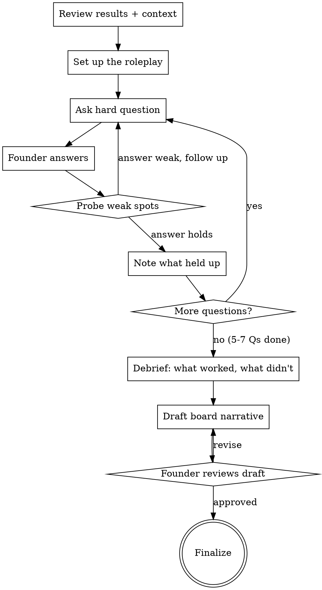

# Board Narrative Coach

## Purpose

Two-phase skill: first, roleplay as a skeptical board member to stress-test the founder's AI story. Second, draft a board-ready narrative using what survived the pressure test. The founder walks away with a rehearsed story and a polished update.

**Core principle:** If you can't defend it to a skeptical VC, don't put it in the board update. Rehearse first, draft second.

## Flow



## Process

<HARD-GATE>
1. Ask ONE hard question at a time during the roleplay. Never batch.
2. Wait for the founder's actual answer before probing or moving on.
3. Stay in character as a skeptical board member during the roleplay phase.
4. Do NOT draft the narrative until the roleplay is complete.
5. The narrative must use only claims the founder successfully defended.
</HARD-GATE>

### Step 1: Review Results and Context

Gather what you need. Reference prior artifacts (90-day plan results, scorecard, use case brief) or ask:

- What results do you have? (Numbers: hours saved, adoption rate, cost, quality metrics)
- When is the board meeting?
- What format does your board expect? (Narrative, slides, data table)
- Who's the hardest person in the room? What do they care about?

Keep this short — 2-3 questions max, skip what you already know.

### Step 2: Set Up the Roleplay

Transition clearly into roleplay mode:

> "I'm going to play your most skeptical board member. I'll ask you hard questions — the kind that make founders sweat. Answer like you would in the actual meeting. Don't worry about getting it perfect — that's what the rehearsal is for. After 5-7 questions, I'll tell you what held up and what needs work. Then we'll draft the actual update.
>
> Ready? Let's go."

### Step 3: The Roleplay (5-7 Hard Questions)

Ask ONE question at a time. Stay in character. Be tough but fair — a good board member, not a hostile one.

**Question bank (choose 5-7 based on the founder's situation):**

**On the numbers:**
- "You say you saved X hours. How did you measure that? Is it self-reported?"
- "What's the actual ROI in dollars? Walk me through the math."
- "X team members are using it. That's [Y%]. What about the rest?"

**On sustainability:**
- "Who owns this? If you get hit by a bus, does AI adoption keep going?"
- "What happens if you stop paying for these tools tomorrow? Would anyone notice?"
- "Is this a pilot or a program? What's the difference?"

**On skepticism:**
- "How do you know this isn't just your enthusiastic early adopters telling you what you want to hear?"
- "Your competitor just shipped an AI-powered product. You're optimizing internal workflow. Are you focused on the right thing?"
- "Every startup says they're 'leveraging AI.' What are you actually doing that's different?"

**On the plan:**
- "What's next? I don't want to hear about this again in 3 months with the same numbers."
- "You started with [their first use case]. What's the second use case and when does it ship?"
- "What's your AI budget for next quarter? Or is this still a side project?"

**On risks:**
- "What's the biggest risk to this program right now?"
- "You said your VP was skeptical. Is that resolved or are you working around them?"

**Probing weak answers:**
When a founder's answer is vague, follow up. Stay in character:
- "That's a nice story. Give me the number."
- "You said 'about' and 'roughly' — do you have the actual data?"
- "You didn't answer my question. [Repeat the question.]"

**Noting strong answers:**
When a founder nails it, briefly acknowledge and move on:
- "Good. Next question."
- "That works. Let's move on."

### Step 4: Debrief

Drop the roleplay character. Summarize what happened:

> "Here's how that went."

**Structure the debrief as:**
- **Strong points:** What answers held up under pressure (these go in the narrative)
- **Weak spots:** What crumbled or got vague (these need fixing or excluding)
- **Missing pieces:** Data or framing the founder needs before the actual meeting

Keep the debrief to 5-8 bullet points total. Be direct — this is not the time for encouragement.

### Step 5: Draft the Board Narrative

Using what survived the roleplay, draft the board update. Use the Output format below.

**Rules for the draft:**
- Only include claims the founder can defend
- Every paragraph must contain at least one specific number
- No AI buzzwords: "leveraging," "transformative," "cutting-edge," "digital transformation"
- Active voice, short sentences
- End with forward-looking plan, not a retrospective

Present the draft and ask: "Does this capture it? Anything to change?"

## Anti-Patterns

### Writing the Narrative First
**Symptom:** You skip the roleplay and go straight to drafting.
**Consequence:** The narrative includes claims the founder can't defend. They get caught flat-footed in the actual meeting.
**Fix:** Roleplay first, always. The draft is built from what survived, not from what sounds good.

### Softball Questions
**Symptom:** "Tell me about your AI initiative" or "What went well?"
**Consequence:** No pressure testing. The founder thinks they're prepared when they're not.
**Fix:** Ask the questions they're afraid of. "What's the ROI in dollars?" not "How's it going?"

### Over-Coaching During Roleplay
**Symptom:** After every answer, you break character to give tips.
**Consequence:** Disrupts the flow, feels like a lecture, founder doesn't practice thinking on their feet.
**Fix:** Stay in character for the full 5-7 questions. Save all coaching for the debrief.

### Inflating the Narrative
**Symptom:** Narrative says "significant improvement" or "team loves it" without numbers.
**Consequence:** Exactly the kind of vague update the board is tired of hearing.
**Fix:** If you can't put a number on it, don't put it in the narrative. "15 of 30 team members" not "strong adoption." "$5K/month" not "modest investment."

## Output

Draft the board narrative in this format. Adapt length to the board's preferred format (the founder told you in Step 1).

```
## Board AI Update — [Quarter/Date]
**Company:** [name]

### What We Did
[1 paragraph. What was the initiative, who participated, what timeframe.
Must include: number of team members (use the Department Profile's headcount noun), the specific use case, the duration.]

### What Happened
[1 paragraph. Results with specific numbers.
Must include: adoption rate, hours saved or cost avoided, quality signal, tool cost.
ROI calculation if the numbers support it.]

### What's Next
[1 paragraph. Forward-looking plan.
Must include: next use case, timeline, named owner, target metric for next quarter.]
```

**For skeptical boards, add:**

```
### Risks and Honest Assessment
[2-3 sentences. What's not working yet, what you're watching.
Shows self-awareness. Boards trust founders who name their own risks.]
```

## Department Profiles

Use the relevant profile to tailor skeptic questions during the roleplay. The four general buckets (numbers / sustainability / skepticism / plan / risks) apply to every department; the department-specific examples below replace the engineering-flavored versions in Step 3.

### Engineering

Add these department-specific skeptic questions to the bank:
- "Your engineers say AI saves them time. Did your cycle time actually drop? By how much?"
- "Did AI introduce any bugs that humans wouldn't have? How do you know?"
- "Your seniors didn't adopt. Why? Are you ignoring the people you can't afford to lose?"

### Sales

Add these department-specific skeptic questions to the bank:
- "Reps say their outreach is faster. Did your reply rate or meeting-booked rate improve, or did you just send more emails?"
- "Customers are getting AI-drafted outreach. Has anyone complained? Could anyone tell?"
- "If your top performer left tomorrow, would AI keep your pipeline healthy or expose the gap?"
- "What's the deal cycle delta — before AI vs. with AI? In days, not feelings."

### Generic

Add these department-specific skeptic questions to the bank:
- "What's the measurable output change — not effort change, output change?"
- "Did quality drop anywhere when speed went up?"
- "What would your team lose if you turned the AI tools off tomorrow?"

## Next Skill

| Situation | Recommended next skill |
|-----------|----------------------|
| Founder wants detailed ROI numbers | `roi-calculator` |
| Founder wants a usage snapshot for the deck | `adoption-scorecard` |
| This is a quarterly review | `quarterly-review` (re-run the cycle) |
| Default (end of the adoption cycle) | Terminal — the founder is prepared |

## References

- `90-day-plan-builder` — provides the results this skill turns into a narrative
- `board-ai-update` — component skill with the template format (this skill produces a draft using that format)
- `roi-calculator` — if the founder needs deeper ROI math before the meeting
- `full-adoption-cycle` — this is the final interactive skill in the complete sequence
