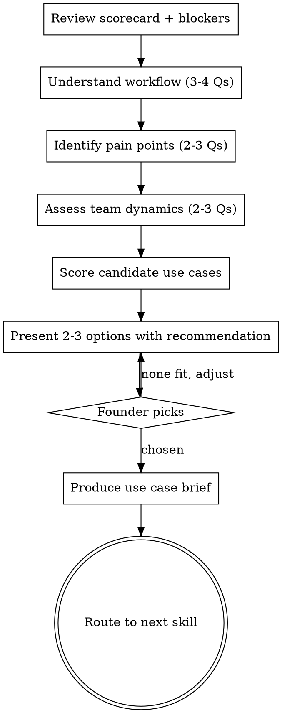

# First Use Case Picker

## Purpose

Helps a founder choose the right first AI use case for their team. The goal is maximum visible wins with minimum friction — not the theoretically best use case, but the one most likely to actually succeed and shift attitudes. Produces a scored comparison of 2-3 use cases with a clear recommendation.

**Core principle:** The first use case isn't about productivity. It's about proof. Pick the one that creates believers.

## Flow



## Process

<HARD-GATE>
1. Ask ONE question at a time. Never batch questions.
2. Wait for the founder's actual answer before proceeding.
3. Do NOT recommend a use case until you've completed the discovery questions.
4. Always present 2-3 options scored against criteria — never just one answer.
5. The founder picks. You recommend, they decide.
</HARD-GATE>

### Step 1: Review Context

Reference the fluency scorecard and blocker report if available. If not, ask for a quick summary.

> "Let's find the right place to start. I need to understand your team's workflow, where time gets wasted, and who's most likely to try something new. A few questions, then I'll give you 2-3 options scored against what matters for a first win."

### Step 2: Understand the Workflow

You need to know how work actually flows through the team to find where AI fits naturally.

**Questions (ask one at a time):**
- What does a typical week look like for your team? What takes the most time?
- Walk me through your team's core workflow — start to finish. Where are the bottlenecks?
- What repetitive tasks does your team complain about?
- Are there tasks people avoid or procrastinate on?
- What tasks does your team do that always start from a blank page — writing something from scratch every time?

### Step 3: Identify Pain Points

Find the specific friction points where AI could help.

**Questions:**
- What's the thing your team spends time on that feels like it should be faster?
- When was the last time someone said "I wish I didn't have to do this manually"?
- What's the biggest time sink that doesn't directly produce output for customers or the business?

### Step 4: Assess Team Dynamics

Understand who would actually try a new tool and who needs convincing.

**Questions:**
- Who on your team would be the first to try something new? What's their role?
- If your biggest skeptic saw AI save someone 2 hours, would that move them? Or would they find a reason to dismiss it?
- Does your team share wins informally, or does information stay siloed?

### Step 5: Score Candidate Use Cases

Based on what you've learned, identify 2-3 candidate use cases and score them against five criteria:

| Criterion | What it means | Why it matters for a first use case |
|-----------|--------------|-------------------------------------|
| **Visibility** | Will the result be seen by others? | First use case needs witnesses. Hidden wins don't spread. |
| **Time to result** | How fast will someone see value? | Must show results in 2-4 weeks or momentum dies. |
| **Friction** | How hard is it to start? | Every setup step loses people. Lower friction = higher adoption. |
| **Skeptic-resistance** | Can skeptics dismiss the result? | If the most senior or skeptical team member can wave it away, it didn't work. |
| **Failure cost** | What happens if it doesn't work? | First use case must be safe to fail. Low stakes. |

**Bonus lens: Does this eliminate blank-page work?**

The highest-impact first use cases remove tasks that currently start from zero. If team members are routinely starting from a blank document — drafting outreach emails, writing boilerplate code, building decks from scratch, summarizing meetings by hand — that's blank-page work. AI eliminates it by providing a starting point that humans refine.

When scoring candidates, favor use cases where AI replaces "start from nothing" with "start from a draft." These produce the most visceral time savings and are hardest for skeptics to dismiss — the before/after is obvious.

Score each candidate 1-5 on each criterion. Higher = better.

**Common use case candidates and their typical profiles:**

Use the relevant department profile below for use case candidates. These are defaults — adjust scores based on what you learned about this specific team.

### Step 6: Present Options

Present 2-3 use cases with scores and a clear recommendation. Lead with your recommendation and explain why.

> "Based on what you've told me, here are three options. I'd go with Option A, and here's why."

Present each option briefly:
- What it is (one sentence)
- Why it fits this team specifically (tie back to their workflow and pain points)
- Scores on the five criteria
- The main risk

Then ask: "Which of these feels right for your team?"

### Step 7: Produce Use Case Brief

Once the founder picks, produce the brief.

## Anti-Patterns

### Recommending Before Understanding
**Symptom:** You suggest "code review" after hearing the company name and team size.
**Consequence:** Generic recommendation that may not fit their specific workflow or blockers.
**Fix:** Complete all discovery questions first. The best use case depends on their bottlenecks, team dynamics, and what's already been tried.

### The Ambitious First Project
**Symptom:** Founder wants to start with "AI-powered feature for customers" or "rewrite our CI pipeline with AI."
**Consequence:** Too complex, too long, too risky. Failure sets adoption back months.
**Fix:** "That could be a great second or third use case. For the first one, we want something that proves value in 2-4 weeks with minimal risk. Let's start smaller and build credibility for that bigger project."

### Picking for Productivity Instead of Proof
**Symptom:** The use case with the highest theoretical ROI wins.
**Consequence:** High-ROI use cases are often high-friction and hard to demonstrate. The first use case needs to create believers, not maximize efficiency.
**Fix:** Score on all five criteria, not just time savings. Visibility and skeptic-resistance matter more for the first use case than raw productivity.

### Ignoring the Blocker Report
**Symptom:** Recommending an AI tool that generates work-product content when the blocker report says seniors have identity-based resistance to AI replacing their expertise (e.g., code completion for engineers, AI-drafted outreach for top sales reps, AI-written copy for marketers).
**Consequence:** The use case triggers the exact barrier that's already blocking adoption.
**Fix:** Cross-reference the blocker report. If psychological barriers are high, favor use cases where AI reviews/assists rather than generates. If integration is the issue, favor use cases with zero setup.

## Output

Produce the use case brief in this exact format:

```
## First Use Case Brief
**Company:** [name] | **Date:** [date]

### Chosen Use Case
[Name of the use case — engineering: "AI-assisted code review on pull requests" / sales: "AI-drafted prospecting emails" / generic: "AI meeting summaries with action items"]

### Why This One
[2-3 sentences tying the choice to this team's specific workflow, pain points, and dynamics]

### Criteria Scores

| Criterion | Score |
|-----------|:-----:|
| Visibility | X/5 |
| Time to result | X/5 |
| Friction | X/5 |
| Skeptic-resistance | X/5 |
| Failure cost | X/5 |
| **Total** | **X/25** |

### Who Runs the Pilot
[Specific role or person — the champion, a willing team, etc.]

### Quality Bar for Stage 1
[What "good enough" means for AI output in this use case. Set it low on purpose: "good enough to move work forward" not "ready to publish." Perfectionism kills early adoption — the team needs to see AI as a useful starting point, not a replacement for their judgment.]

### Baseline (Before Pilot Starts)
[The current number for the metric you'll use to prove success — e.g., engineering: "Average PR review time: 45 minutes. Engineers using AI tools weekly: 2 of 14." Sales: "Average proposal turnaround: 3 days. Reps using AI weekly: 3 of 12." Generic: "Average meeting-notes turnaround: 2 days. Team members using AI weekly: 4 of 20." Without this, there's nothing to compare against at Week 4.]

### What Success Looks Like in 2 Weeks
[One concrete, measurable outcome — e.g., engineering: "AI catches at least 3 real issues in PRs that humans confirm were valid." Sales: "AI-drafted outreach matches or beats the rep's reply rate on 5+ campaigns." Generic: "AI summaries cut meeting-note time by 50% on at least 5 recurring meetings."]

### What Success Looks Like in 4 Weeks
[One concrete, measurable outcome focused on **repeat use** — e.g., "5+ team members voluntarily use it for every relevant task, not just when reminded." Repeat use is the signal that adoption is real. One-off demos and novelty don't count.]

### Alternatives Considered
- [Option B — one line on why it wasn't chosen]
- [Option C — one line on why it wasn't chosen]
```

## Next Skill

After the use case is picked:

| Situation | Recommended next skill |
|-----------|----------------------|
| Founder wants a full rollout plan | `90-day-plan-builder` |
| Founder needs board-ready story | `board-narrative-coach` |
| Founder wants to understand cost/benefit | `roi-calculator` |
| Default | `90-day-plan-builder` |

## Department Profiles

### Engineering

| Use case | Visibility | Time to result | Friction | Skeptic-resistance | Failure cost |
|----------|:----------:|:--------------:|:--------:|:------------------:|:------------:|
| AI-assisted code review | 4 | 4 | 5 | 4 | 5 |
| Test generation | 3 | 3 | 3 | 3 | 4 |
| PR descriptions/summaries | 5 | 5 | 5 | 2 | 5 |
| Documentation drafts | 3 | 4 | 4 | 2 | 5 |
| Bug investigation/debugging | 4 | 3 | 3 | 4 | 4 |
| Code migration/refactoring | 3 | 2 | 2 | 4 | 2 |
| Boilerplate/scaffolding | 2 | 5 | 4 | 1 | 5 |

A team that hates writing docs will score documentation higher on pain-point relief. A team with flaky tests will score test generation higher.

### Sales

| Use case | Visibility | Time to result | Friction | Skeptic-resistance | Failure cost |
|----------|:----------:|:--------------:|:--------:|:------------------:|:------------:|
| AI-drafted prospecting emails | 5 | 5 | 5 | 3 | 4 |
| Meeting summary + CRM auto-update | 3 | 5 | 5 | 2 | 5 |
| Proposal/deck first draft | 4 | 4 | 4 | 3 | 4 |
| Pipeline risk scoring | 4 | 3 | 2 | 4 | 3 |
| Call analysis and coaching | 3 | 3 | 2 | 4 | 3 |
| Competitive research briefs | 3 | 5 | 4 | 2 | 5 |

A sales team buried in CRM admin will score "Meeting summary + CRM auto-update" higher on pain-point relief. A team with high outreach volume will score "AI-drafted prospecting emails" highest on visibility.

**Note on best-fit roles:** Prospecting emails fit SDRs; CRM auto-update fits AEs who avoid data entry; proposal drafts fit AEs with repetitive RFPs; pipeline scoring and call analysis fit Sales Managers. Capture role fit in the Use Case Brief's "Who Runs the Pilot" field — don't bake it into the scoring schema.

### Generic

| Use case | Visibility | Time to result | Friction | Skeptic-resistance | Failure cost |
|----------|:----------:|:--------------:|:--------:|:------------------:|:------------:|
| Meeting summaries with action items | 4 | 5 | 5 | 3 | 5 |
| First-draft documents (memos, briefs, status reports) | 4 | 5 | 5 | 2 | 5 |
| Research synthesis from multiple sources | 3 | 4 | 4 | 3 | 4 |
| Inbox / message triage and reply drafts | 3 | 5 | 5 | 2 | 5 |
| Data extraction or cleanup from unstructured input | 3 | 4 | 3 | 4 | 4 |
| Workflow automation of repetitive admin steps | 4 | 3 | 3 | 4 | 4 |

A team buried in meetings will score "Meeting summaries with action items" highest on pain-point relief. A team that produces a lot of internal documents will score "First-draft documents" highest on visibility. Adjust based on which workflow stage actually slows the team down.

## References

- `fluency-assessment` — provides the scorecard that informs use case selection
- `blocker-diagnosis` — identifies which barriers the use case must avoid triggering
- `90-day-plan-builder` — most common next step, builds the rollout plan around the chosen use case
