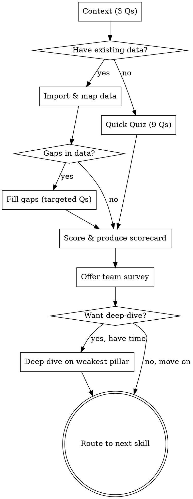

# AI Fluency Assessment

## Purpose

Quick diagnostic that scores an organization's AI fluency across three pillars: psychological barriers, integration failures, and ownership gaps. Produces a one-page scorecard the leader can act on. This skill MUST run before any other interactive or workflow skill. It's the diagnostic before the prescription.

**Core principle:** Diagnose before you prescribe. This skill assesses — it does NOT build plans, pick tools, or write board narratives. Those are separate skills.

**Time:** Under 5 minutes for the quick quiz. Even faster if the leader has existing survey or assessment data. Optional deep-dive available if the leader wants more detail.

## Flow



## Process

<HARD-GATE>
1. Ask ONE question at a time. Never batch questions.
2. Wait for the leader's actual answer before proceeding. Never simulate or assume answers.
3. Present quiz questions with their multiple-choice options. The leader picks a letter.
4. Do NOT give advice, solutions, or recommendations during the assessment. Diagnose only.
5. Do NOT suggest tools, processes, or plans. That comes from other skills after this one.
</HARD-GATE>

### Step 1: Context (3 questions)

Get just enough context to interpret the quiz answers. Ask one at a time:

1. **"Tell me about your team — how big, what they do, and what's your role?"**
2. **"What AI tools does your team have access to today, if any?"**
3. **"Which best describes the team you're assessing?"**
   - A) Engineering / Product / Technical
   - B) Sales / Business Development
   - C) Marketing / Communications
   - D) Customer Support / Success
   - E) Finance / Legal / Operations / HR
   - F) Multiple departments / Whole organization

**Profile routing:**
- A → Engineering profile
- B → Sales profile
- C, D, E → Generic profile (department-neutral probes; specialized profiles for these are not yet built)
- F → Ask one follow-up: **"Which department has the biggest gap today? We'll start there and you can run this assessment again for another department later."** Record both the cross-functional context and the primary department on the scorecard. Downstream skills focus on the primary department.

The scorecard's `Department:` field records the leader's pick. Every downstream skill (`blocker-diagnosis`, `first-use-case-picker`, `90-day-plan-builder`, `roi-calculator`, `adoption-scorecard`, `board-ai-update`, `board-narrative-coach`, `tool-stack-audit`) reads this field and loads the matching profile.

Don't ask about funding stage, runway, or history. Get to the assessment fast.

### Step 2: Check for Existing Data

After context questions, ask:

> **"Have you already run a survey or assessment on AI adoption — even an informal one? If so, share the results and I'll map them to our framework instead of starting from scratch."**

After the existing data question, also ask:

> **"Has your organization restructured, or is it planning to restructure, in connection with AI adoption — role changes, headcount adjustments, new positions, or team reorganization?"**

If yes, ask one follow-up: **"What changed — which roles, how many people affected?"** A bare "yes" isn't enough — this follows the same principle as rejecting vague self-assessment.

Record the answer as one of three states for the scorecard:
- **Stable** — no restructuring
- **Restructuring in progress** — changes are happening now
- **Restructuring completed [timeframe]** — changes happened, team is now stable

**If they have data:** Go to Step 2a (Import Existing Data).
**If they don't:** Go to Step 3 (Quick Quiz).

### Step 2a: Import Existing Data

Accept whatever format they share — survey results, spreadsheet exports, summary notes, screenshots. Map their data to the three pillars using this approach:

1. **Extract signals.** Read through the data and identify anything that maps to psychological barriers, integration failures, or ownership gaps. Use the survey-to-pillar mapping table (see Team Survey Template section) as a guide, but be flexible — their questions won't match ours exactly.

2. **Score what you can.** For each pillar where you have enough signal, assign a 1-4 raw score based on what the data tells you. Use the same scoring logic as the quiz: 1 = no engagement, 4 = fluent.

3. **Identify gaps.** Check which pillars have weak or missing signal. Common gaps:
   - External surveys rarely cover **psychological barriers** well (people don't self-report fear or identity threat accurately)
   - **Ownership gaps** often aren't covered unless the survey explicitly asked about process and accountability
   - **Integration** data is usually the strongest since most surveys ask about tool usage

4. **Fill gaps with targeted questions.** For each pillar with insufficient data, ask 1-2 questions from the Quick Quiz (Step 3) that cover the gap. Tell the leader why:

   > "Your survey gives me a good picture of [covered pillars]. I'm missing signal on [gap pillar] — let me ask [1-2] quick questions to fill that in."

   Pick the most diagnostic question per pillar:
   - Psychological Barriers gap → ask Q2 (reasons for non-use) and Q3 (leadership modeling)
   - Integration gap → ask Q4 (team relationship with tools) and Q6 (breadth of use)
   - Ownership gap → ask Q7 (who owns it) and Q8 (how you measure)

5. **Proceed to scoring** (Step 4) once all three pillars have signal.

<HARD-GATE>
Do NOT accept vague summaries as data. "Team seems positive" is not data. Push for specifics: "What percentage responded? What were the actual response distributions?" If the shared data is too vague to score, say so honestly and offer the quick quiz as a faster path than going back and forth on interpretation.
</HARD-GATE>

### Step 3: Quick Quiz (9 questions)

Ask ONE question at a time. Present the options exactly as written. The leader picks A, B, C, or D. Each answer maps to a score (shown in brackets — do NOT show the scores to the leader).

**Psychological Barriers (3 questions)**

**Q1. How does your team talk about AI tools?**
- A) They don't — it doesn't come up [1]
- B) Mixed — some people are interested, others push back or avoid the topic [2]
- C) Generally positive, but a few vocal skeptics or quiet resisters [3]
- D) Most people are open to it — the conversation is about how, not whether [4]

**Q2. When someone on your team says they don't use AI tools, what's the usual reason?**
- A) "I don't need it" or "it's not good enough" — without having tried it seriously [1]
- B) "I tried it and it didn't help" — but only briefly or for the wrong task [2]
- C) "It doesn't fit how I work" — a specific workflow complaint [3]
- D) Most people use them — the holdouts are the exception, not the norm [4]

**Q3. Do your leaders and managers use AI tools themselves?**
- A) No — they talk about AI but don't use it personally [1]
- B) A couple do, but it's not visible to the team [2]
- C) Some do and share what they learn, but it's inconsistent [3]
- D) Yes — leadership models AI use and it's visible to the team [4]

**Integration (3 questions)**

**Q4. How would you describe your team's current relationship with AI tools?**
- A) We have licenses but most people haven't really started [1]
- B) Some individuals use them from time to time [2]
- C) A group uses them regularly for specific tasks [3]
- D) AI is part of how the team works — some tasks always start with AI now [4]

**Q5. When people use AI, what does a typical interaction look like?**
- A) Simple questions, take the answer as-is [1]
- B) They give some context to shape the output [2]
- C) They go back and forth, refining until the output is useful [3]
- D) They use templates, custom prompts, or built-in workflows for recurring tasks [4]

**Q6. How many different tasks or workflow steps does your team use AI for?**
- A) None, or just one thing (like autocomplete) [1]
- B) 2-3 things, but it's individual — everyone uses it differently [2]
- C) A few shared use cases that multiple people use [3]
- D) AI is used across multiple workflow stages [4] _(use the relevant Department Profile's Q6 Option D phrasing for a concrete example, e.g., "writing, reviewing, testing, docs" for engineering)_

**Q7. How evenly is AI use spread across functions in your organization?**
- A) No function uses AI meaningfully yet [1]
- B) One function (usually engineering) uses AI — others have barely started [2]
- C) Two or three functions use AI regularly — back-office and customer-facing teams lag [3]
- D) AI is in use across engineering, product, GTM, support, and back-office — depth varies, but every function is in [4]

**Ownership (4 questions)**

**Q7. Who is responsible for making AI adoption work in your organization?**
- A) Nobody specifically — or "me, alongside everything else" [1]
- B) It's loosely assigned to someone, but it's not their main focus [2]
- C) Someone has it as a real responsibility with some dedicated time [3]
- D) There's a named owner with a clear mandate, time, and authority [4]

**Q8. How do you know if AI tools are actually helping?**
- A) I don't — we have no way to measure it [1]
- B) We track license count or login activity [2]
- C) We have some usage data and anecdotal feedback [3]
- D) We measure specific outcomes — time saved, quality changes, or workflow metrics [4]

**Q9. When someone has a problem with an AI tool, what happens?**
- A) Nothing — they stop using it and nobody notices [1]
- B) They might mention it in passing, but there's no formal channel [2]
- C) There's someone they can ask, but no systematic feedback loop [3]
- D) There's a clear process — issues get reported, tracked, and addressed [4]

### Step 4: Score

**Scoring method:**
- Each answer maps to a score of 1-4 (shown in brackets above)
- Per pillar: average the 3 question scores, then map to 1-5 scale:
  - Average 1.0-1.5 → **Score 1/5**
  - Average 1.6-2.2 → **Score 2/5**
  - Average 2.3-2.9 → **Score 3/5**
  - Average 3.0-3.6 → **Score 4/5**
  - Average 3.7-4.0 → **Score 5/5**
- Overall: average the three pillar scores

**Scoring guidance:**
- Score reflects the PROBLEM severity, not the team's quality. A score of 2/5 on psychological barriers means "significant unaddressed psychological resistance."
- Be honest. Leaders need accurate diagnosis, not encouragement.
- Higher score = better fluency (fewer barriers, better integration, stronger ownership).
- **Score behavior, not access.** Having licenses is not adoption. People logging in is not adoption. Adoption means the work has actually changed.

Produce the scorecard using the Output format below.

### Step 5: Offer Team Survey + Optional Deep-Dive

After presenting the scorecard:

> "This scorecard is based on your perspective — under 5 minutes, so it's a quick read. Two things I'd recommend:
>
> 1. **Send a 5-minute survey to your team** to get their side of the picture. I can draft it for you.
> 2. **If you have 10 more minutes**, I can do a deeper dive on your weakest pillar — [name it] — to understand the specific blockers.
>
> Which would you like? Both? One? Or just move to the next step?"

**If they want the deep-dive:** Use the Deep-Dive Probes section below on the lowest-scoring pillar only. Ask 3-4 targeted questions. Update the scorecard if the deep-dive changes your assessment.

**If they want the survey:** Produce the Team Survey Template below.

**If they want to move on:** Route to the next skill.

### Step 6: Route to Next Skill

Based on the scorecard, recommend ONE next step. See the Next Skill section below.

## Deep-Dive Probes

Use these ONLY if the leader opts for the deeper assessment on a specific pillar. Ask 3-4 questions from the relevant section. Use the relevant department profile below for deep-dive probes, signal tables, and survey options.

### Psychological Barriers Deep-Dive

Ask about who avoids AI tools, their role and seniority, what they say when explaining non-use, whether seniors and juniors behave differently, and how managers talk about AI. Use the relevant department profile's probes and signal table.

### Integration Deep-Dive

Ask about specific times someone tried an AI tool and stopped, how long they tried, whether the tool was configured for their context, and whether there's a recurring task the team hates. Use the relevant department profile's probes and signal table.

### Ownership Deep-Dive

- When something goes wrong with AI tool adoption, who hears about it?
- If I asked you right now how many people used an AI tool this week, could you tell me?
- Has anyone set a goal like "X people using Y tool by Z date"?
- Who would you call the AI adoption champion on your team?

**What you're listening for:**

| Signal | Gap | Severity |
|--------|-----|----------|
| "Me, plus my 5 other jobs" | No dedicated owner | Critical |
| "We have license count" as the only metric | No real measurement | Critical |
| No feedback channel for tool issues | No feedback loop | High |
| "We'll figure it out organically" | Wishful thinking | Critical |

## Anti-Patterns

### "We're Pretty Early"
**Symptom:** Leader gives vague self-assessment to avoid specifics.
**Consequence:** Assessment stays surface-level, scorecard is useless.
**Fix:** "Early is fine — let me understand what 'early' looks like specifically. Of your team, how many have tried any AI tool even once?"

### "Just Tell Me What to Do"
**Symptom:** Leader tries to skip assessment and get straight to solutions.
**Consequence:** Generic advice that doesn't fit their actual situation.
**Fix:** "This is 9 quick questions — under 5 minutes. It makes everything after this specific to your situation instead of generic advice."

### "Our CTO Will Handle It"
**Symptom:** Leader delegates AI adoption without defining what "handle it" means.
**Consequence:** Ownership gap goes undiagnosed because someone's name is attached.
**Fix:** "What specifically are they doing on this? What's their timeline? What metrics are they tracking?" If the answer is vague, it's still an ownership gap.

### Advice Creep
**Symptom:** You start suggesting tools, processes, or plans mid-assessment.
**Consequence:** Diagnosis gets contaminated. Leader anchors on premature recommendations.
**Fix:** STOP. Return to the next question. Recommendations come from other skills.

## Output

After all questions, produce the scorecard in this exact format:

```
## AI Fluency Scorecard
**Company:** [name] | **Team:** [size] | **Date:** [date]
**Team stability:** [Stable / Restructuring in progress — [description] / Restructuring completed [timeframe] — [description]]
**Department:** [from Q3]

### Scores (1-5 scale)

| Pillar | Score | One-line summary |
|--------|:-----:|------------------|
| Psychological Barriers | X/5 | [key finding] |
| Integration Failures | X/5 | [key finding] |
| Ownership Gaps | X/5 | [key finding] |
| **Overall** | **X/5** | **[overall status]** |

### Fluency Levels
- **1** — No awareness or action. Team has access but hasn't engaged.
- **2** — Trying it out. Some individuals experimenting, but no consistency. People are still deciding if it's worth their time.
- **3** — Assisted use. A group uses AI regularly for specific tasks, but it's optional and individual. Effort sometimes feels disproportionate to results.
- **4** — Integrated. AI is embedded in team workflows, not just individual habits. Defaults have changed — some work no longer starts from scratch.
- **5** — Fluent. AI is invisible and expected. New hires pick it up by watching how the team works. Decisions are better, not just faster.

### Data Source
**Based on:** [Leader quiz / Imported data + gap-fill / Leader quiz + deep-dive / Leader quiz + team survey]
[If quiz-only: "These scores reflect your perspective. A 5-minute team survey would sharpen the picture — especially on psychological barriers, where leaders often underestimate resistance."]
[If imported data: "These scores combine your existing survey data with targeted questions to fill gaps. Data source: [describe what they shared]."]

### Top Finding
[Single most important thing this leader needs to address, in 2-3 sentences]

### Biggest Risk
[What will go wrong if they do nothing, in 1-2 sentences]
```

## Next Skill

Based on the scorecard, recommend ONE next step:

| Lowest-scoring pillar | Recommended next skill | Why |
|----------------------|----------------------|-----|
| Psychological Barriers | `blocker-diagnosis` | Need to understand the specific resistance before acting |
| Integration Failures | `first-use-case-picker` | Tools aren't fitting — find the right starting point |
| Ownership Gaps | `90-day-plan-builder` | Need structure, owner, and metrics before anything else |
| Tied or all low | `blocker-diagnosis` | Start with people — tools and process follow |

> "Your biggest gap is [pillar]. I'd recommend running [skill name] next to [one sentence on what it does]. Want to do that now?"

## Team Survey Template

If the leader wants the team survey, produce it in this format. This is sent to the team as a parallel track — it does NOT block the playbook from continuing.

```
## AI Tools — Quick Team Check (anonymous, 5 min)

1. How would you describe your current relationship with AI tools?
   - I haven't really started yet
   - I use them from time to time when someone points me to them
   - They're becoming a regular part of how I work
   - I'd feel less productive without them at this point

2. When you use AI, what does a typical interaction look like?
   - I ask a simple question and take the answer as-is
   - I give some background or instructions to shape the output
   - I go back and forth, adjusting my input until I get what I need
   - I work with templates, system prompts, or pre-built assistants for recurring tasks

3. What have you used AI for? (check all that apply — append department-specific options from the relevant profile)
   - I haven't used it for work yet
   - Writing, editing, or rephrasing text
   - Looking things up or getting explanations
   - Brainstorming or structuring ideas
   - Using an assistant or agent someone else set up
   - Building your own assistant, agent, or workflow
   - Automating repetitive steps in my workflow
   - [Additional department-specific options from the relevant Department Profile]
   - Other: ___

4. How do you feel about AI becoming a bigger part of your work?
   - Skeptical — I'm not convinced it adds value for what I do
   - Curious — I'd like to understand what it can do before committing
   - Optimistic — I see real potential and want to go deeper
   - All in — I'm already pushing boundaries and exploring new use cases

5. What's the biggest reason you DON'T use AI tools more? (pick one)
   - I don't know what to use them for
   - The output isn't good enough for my work
   - It takes more effort than doing it myself
   - I don't trust the output
   - I haven't been given time to learn
   - I use them plenty already
   - Other: ___

6. Does your team have a shared way of using AI tools, or is it individual?
   - We have shared practices and standards
   - Everyone does their own thing
   - We don't really use them as a team

7. Who would you go to if you had a question or problem with an AI tool?
   - A specific person on the team
   - My manager
   - I'd figure it out myself
   - I wouldn't know who to ask

8. Is there a task in your daily work where you think AI could help but you're not sure how?
   [open text]
```

**Mapping survey results to pillar scores:**

| Survey questions | Maps to pillar |
|-----------------|---------------|
| Q4 (feelings), Q5 (reasons for not using) | Psychological Barriers |
| Q1 (relationship), Q2 (interaction depth), Q3 (breadth), Q5 (effort/output) | Integration Failures |
| Q6 (shared practices), Q7 (who to ask) | Ownership Gaps |

**How to generate the survey for a specific team:** Replace the `[Additional department-specific options from the relevant Department Profile]` line in Q3 with the items listed under `Survey Q3 — Additional Department-Specific Options` in the relevant Department Profile (Engineering, Sales, or Generic). Do not include items twice.

## Department Profiles

Use the relevant profile based on the leader's answer to Q3 (department detection).

### Engineering

#### Deep-Dive Probes — Psychological Barriers

- Who on your team actively avoids AI tools? What's their role and seniority?
- When they explain why they don't use them, what do they actually say? (Get exact words)
- Do seniors and juniors behave differently around AI tools?
- Has anyone — even jokingly — said something about AI replacing them?
- How do your managers talk about AI tools? Do they use them themselves?

**What you're listening for:**

| Signal | Barrier Type | Severity |
|--------|-------------|----------|
| "It writes bad code" (from senior who hasn't tried it) | Identity threat | High |
| Engineers quietly ignoring tools | Passive resistance | Medium |
| "Is this going to replace us?" | Fear of replacement | High |
| Juniors use it, seniors don't | Seniority-identity split | High |
| Managers mandate it without using it themselves | Leadership credibility gap | High |

#### Deep-Dive Probes — Integration

- Walk me through a specific time someone tried an AI tool and stopped. What happened?
- How long did they try before deciding it didn't work?
- Did anyone configure the tool for your specific codebase, or was it out-of-the-box?
- When results are inconsistent, can people explain what changed between good and bad output?
- Is there a task your team hates doing that happens every sprint?

**What you're listening for:**

| Signal | Issue | Severity |
|--------|-------|----------|
| "Suggestions are wrong for our codebase" | Context/config problem | High — fixable |
| "I only use it for boilerplate" | Narrow use case adoption | Medium |
| "Results are inconsistent" | Variation confusion — people quit when they can't explain why | High |
| "Too many steps to use it" | Friction problem | Medium |

#### Deep-Dive Probes — Ownership

[Use the same ownership probes as the main section — ownership questions are department-neutral]

#### Q6 Option D (Workflow Breadth)
"AI is used across several workflow stages — writing, reviewing, testing, docs, etc."

#### Survey Q3 — Additional Department-Specific Options
- Writing or reviewing code
- Generating or running tests
- Debugging
- Writing documentation
- Code review
- Other: ___

### Sales

#### Deep-Dive Probes — Psychological Barriers
- "Do your top performers resist AI? What do they say about relationship-building vs. automation?"
- "Has anyone said customers will know it's AI-generated? What specifically triggered that concern?"
- "Do managers use AI for their own pipeline reviews or forecasts?"

#### Deep-Dive Probes — Integration
- "Is AI connected to your CRM? When reps tried AI for outreach, what happened?"
- "How long did they try before deciding it didn't work? One email or a full campaign?"
- "Is there a task your reps hate doing that happens every week?" (CRM logging, meeting notes, proposal formatting)

#### Deep-Dive Probes — Ownership

[Use the same ownership probes as the main section — ownership questions are department-neutral]

#### Q6 Option D (Workflow Breadth)
"AI is used across several workflow stages — prospecting, meeting prep, proposals, pipeline analysis, etc."

#### Survey Q3 — Additional Department-Specific Options
- Prospecting or outreach emails
- Proposal or deck drafting
- Meeting prep or research
- Meeting summaries or call notes
- CRM updates or data entry
- Pipeline analysis or forecasting
- Competitive research
- Other: ___

### Generic

Use this profile when the team isn't Engineering or Sales (Q3 options C, D, E) or when you genuinely need department-neutral probes.

#### Deep-Dive Probes — Psychological Barriers

- Who on the team actively avoids AI tools? What's their role and seniority?
- When they explain why they don't use them, what do they actually say? (Get exact words)
- Do senior and junior team members behave differently around AI tools?
- Has anyone — even jokingly — said something about AI replacing them?
- How do the team's managers talk about AI tools? Do they use them themselves?

**What you're listening for:**

| Signal | Barrier Type | Severity |
|--------|-------------|----------|
| "It's not good enough for my work" (from a senior who hasn't tried it seriously) | Identity threat | High |
| Team members quietly ignoring tools | Passive resistance | Medium |
| "Is this going to replace us?" | Fear of replacement | High |
| Juniors use it, seniors don't | Seniority-identity split | High |
| Managers mandate it without using it themselves | Leadership credibility gap | High |

#### Deep-Dive Probes — Integration

- Walk me through a specific time someone tried an AI tool and stopped. What happened?
- How long did they try before deciding it didn't work?
- Did anyone configure the tool for the team's specific context, or was it out-of-the-box?
- When results are inconsistent, can people explain what changed between good and bad output?
- Is there a recurring task the team hates doing that happens every week?

**What you're listening for:**

| Signal | Issue | Severity |
|--------|-------|----------|
| "Output isn't right for our context" | Context/config problem | High — fixable |
| "I only use it for simple stuff" | Narrow use case adoption | Medium |
| "Results are inconsistent" | Variation confusion — people quit when they can't explain why | High |
| "Too many steps to use it" | Friction problem | Medium |

#### Deep-Dive Probes — Ownership

[Use the same ownership probes as the main section — ownership questions are department-neutral]

#### Q6 Option D (Workflow Breadth)
"AI is used across multiple workflow stages — drafting, reviewing, summarizing, analyzing, etc."

#### Survey Q3 — Additional Department-Specific Options
- Drafting or editing documents
- Summarizing meetings, calls, or notes
- Looking things up or research
- Working with data, spreadsheets, or reports
- Building decks or visual materials
- Automating repetitive steps in my workflow
- Other: ___

## References

- `blocker-diagnosis` — chains from this skill when psychological barriers are the main issue
- `first-use-case-picker` — chains from this skill when integration is the main issue
- `90-day-plan-builder` — chains from this skill when ownership is the main issue
- `full-adoption-cycle` — orchestrates this skill as the first step in the complete sequence
- `quarterly-review` — re-runs this skill and compares to previous scorecard
