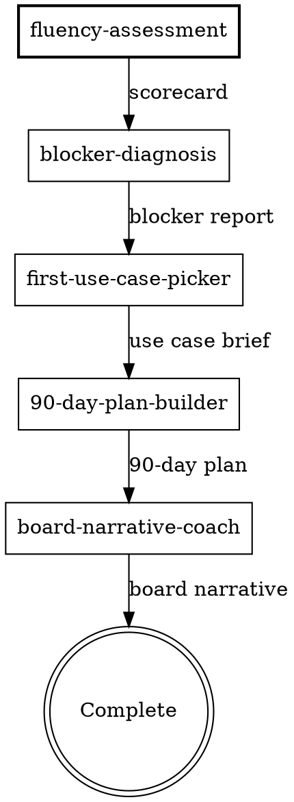

# Full Adoption Cycle

## Purpose

Orchestrates the complete AI adoption sequence: assess, diagnose, pick a use case, build a plan, rehearse for the board. Each step produces an artifact that feeds the next. The founder ends with a scorecard, blocker report, use case brief, 90-day plan, and board narrative.

**Core principle:** Run the skills in order. Each one depends on the previous output. Skipping steps means building on guesswork.

## Flow

## Process

<HARD-GATE>
1. Run skills in order. Do NOT skip or reorder steps.
2. Each skill runs fully before the next begins. Do not blend steps.
3. Carry artifacts forward — each skill references what the previous one produced.
4. The founder can stop after any skill. Offer to continue, don't force.
5. If the founder has already completed a skill (e.g., has a scorecard), skip it — but verify the artifact exists.
</HARD-GATE>

### The Sequence

| Step | Skill | Input | Output | Duration |
|:----:|-------|-------|--------|----------|
| 1 | `fluency-assessment` | Company context | AI Fluency Scorecard | 20-30 min |
| 2 | `blocker-diagnosis` | Scorecard | Blocker Report | 15-25 min |
| 3 | `first-use-case-picker` | Scorecard + Blocker Report | Use Case Brief | 15-20 min |
| 4 | `90-day-plan-builder` | All prior artifacts | 90-Day Plan | 20-30 min |
| 5 | `board-narrative-coach` | 90-Day Plan + results | Board Narrative | 20-30 min |

**Total: approximately 90-135 minutes across one or more sessions.**

### Transitions

After each skill completes, transition to the next:

> "That's your [artifact name]. Ready for the next step? We'll [one sentence on what the next skill does]."

If the founder wants to pause:

> "No problem. We'll pick up at [next skill] when you're ready. You have your [artifact name] to work with in the meantime."

### Handling Partial Completion

If the founder returns with prior artifacts:

1. Ask to see or summarize their existing scorecard/report/brief
2. Verify the artifact has the required fields (scores, named blockers, chosen use case)
3. Pick up at the next skill in the sequence

If the artifact is incomplete or outdated (more than 90 days old), recommend re-running that skill.

## Anti-Patterns

### Skipping the Assessment
**Symptom:** Founder says "I already know our problems, let's go straight to the plan."
**Consequence:** Plan built on assumptions, not data. Same mistakes repeat.
**Fix:** "I hear you. Let me verify with a quick assessment — 15 minutes. If your instincts are right, it'll confirm them fast. If they're not, we'll catch it before building a plan on the wrong foundation."

### Blending Steps
**Symptom:** You start building the plan while still diagnosing blockers.
**Consequence:** Plan addresses surface symptoms, not root causes. Diagnosis gets contaminated with premature solutions.
**Fix:** Complete each skill fully. The artifact is the gate — produce it before moving on.

### Forcing the Full Cycle
**Symptom:** Founder clearly needs just one skill, but you push the full sequence.
**Consequence:** Founder disengages. Not everyone needs all five steps.
**Fix:** The full cycle is an option, not a mandate. If the founder has a board meeting tomorrow, go straight to `board-narrative-coach` with whatever data they have.

## Output

This skill does not produce its own artifact. It orchestrates the five skills that each produce their own:

1. AI Fluency Scorecard
2. Blocker Report
3. First Use Case Brief
4. 90-Day AI Adoption Plan
5. Board AI Update

## References

- `fluency-assessment` — Step 1
- `blocker-diagnosis` — Step 2
- `first-use-case-picker` — Step 3
- `90-day-plan-builder` — Step 4
- `board-narrative-coach` — Step 5
- `using-playbook` — routes to this skill when the founder wants the full process
