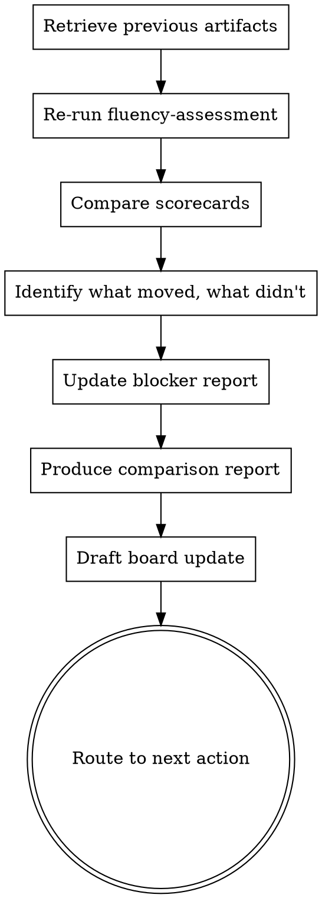

# Quarterly Review

## Purpose

Re-runs the fluency assessment, compares to the previous scorecard, identifies what moved and what didn't, and produces the next board update. This is the ongoing cadence skill — run it every quarter to keep adoption on track and the board informed.

**Core principle:** Measure the delta, not just the current state. The board wants to see trajectory, not a snapshot.

## Flow



## Process

<HARD-GATE>
1. Previous scorecard is REQUIRED. If none exists, run `full-adoption-cycle` instead.
2. Ask ONE question at a time during the re-assessment.
3. Always show the comparison — previous score vs. current score, with what changed.
4. Do NOT inflate progress. If a score stayed flat, say so.
5. The board update must reference the delta, not just current numbers.
</HARD-GATE>

### Step 1: Retrieve Previous Artifacts

Ask the founder for their previous scorecard, blocker report, and 90-day plan results. Summarize what you're comparing against:

> "Let's see how things have moved since last quarter. I'll re-run the fluency assessment, compare it to your previous scores, and we'll draft your next board update. First — do you have your previous scorecard handy?"

Then, after collecting the previous scorecard, ask:

> "Did you kill any AI pilots this quarter? Tools you tried, gave a fair shot, and stopped using — that's the most important section of the report. If yes, I'll capture each one. If no, we'll note that too and check whether that's a portfolio signal."

If they killed pilots, capture for each one: name, cost invested (tool + people time), what it promised, why it was killed, lesson learned, killed date. Push back on vague reasons — "didn't deliver value" is filler; "reps disengaged after week 3" is signal.

### Step 2: Re-Run Fluency Assessment

Run `fluency-assessment` as normal, but with two additions:
- For each pillar, ask "Last time you scored [X/5] here. Has anything changed?" before the detailed questions
- Keep the re-assessment tighter — focus on what's different, not re-establishing baseline

### Step 3: Compare Scorecards

Produce a side-by-side comparison:

| Pillar | Previous | Current | Change |
|--------|:--------:|:-------:|:------:|
| Psychological Barriers | X/5 | X/5 | +X / -X / = |
| Integration Failures | X/5 | X/5 | +X / -X / = |
| Ownership Gaps | X/5 | X/5 | +X / -X / = |
| **Overall** | **X/5** | **X/5** | **+X / -X / =** |

### Step 4: Identify What Moved and What Didn't

For each pillar, explain the change (or lack of change) in one sentence:
- **Improved:** What specific action caused the improvement
- **Flat:** Why it didn't move — was the action taken but ineffective, or was nothing done?
- **Declined:** What went wrong — this is the most important finding

### Step 5: Update Blocker Report

Review the previous blocker report:
- **Resolved blockers:** Mark as resolved, note what fixed them
- **Persistent blockers:** Still there — escalate severity if no action was taken
- **New blockers:** Anything that emerged since last quarter

### Step 6: Produce Comparison Report

Use the Output format below.

### Step 7: Draft Board Update

Use `board-ai-update` template to draft the quarterly update. The "What Happened" section must reference the delta — "Psychological barrier score improved from 2/5 to 3/5 after we..." not just "Our psychological barrier score is 3/5."

## Anti-Patterns

### Celebrating Flat Scores
**Symptom:** "Scores stayed the same — that's stable!"
**Consequence:** Flat scores after a quarter of effort mean the effort didn't work. The board will notice.
**Fix:** Flat = something didn't work. Diagnose why. Was the action taken? Was it the wrong action? Was there no action?

### Ignoring New Blockers
**Symptom:** Only reviewing previous blockers without looking for new ones.
**Consequence:** Adoption surfaces new problems as it progresses. Scaling creates friction that didn't exist at pilot scale.
**Fix:** Always ask "What new challenges have come up since last quarter?" New blockers are expected — missing them is not.

### Comparing to Ideal Instead of Previous
**Symptom:** "You're at 3/5, you should be at 5/5."
**Consequence:** Demoralizing. Ignores real progress.
**Fix:** Compare to the previous scorecard. "You went from 2/5 to 3/5 — here's what moved it, here's what to do next to get to 4."

### All-Green Quarterly Reports
**Symptom:** Every use case is "above plan" or "on plan." No killed pilots. No measuring-still flags.
**Consequence:** Reads as too rosy. Boards have learned that all-green AI reports mean the team is hiding failures or not measuring rigorously enough. Credibility erodes.
**Fix:** A real quarter has mixed status. Aim for: 5 above/on plan, 2 below or measuring. Surface at least one killed pilot per quarter if any portfolio activity happened. If the quarter was genuinely all-green, name what's at risk in the next quarter — boards trust founders who name their own risks.

### Missing Adoption Trade-offs
**Symptom:** Scores improved but the founder doesn't mention that pushing adoption created new friction — output quality concerns, team morale dips, or team members feeling surveilled (engineers worried about commits being tracked; reps worried about call recordings; etc.).
**Consequence:** The cure causes a new disease. Next quarter's blockers are side effects of this quarter's push.
**Fix:** Always ask: "Did pushing adoption create any new tension — with quality, morale, or team autonomy?" If yes, log it as a new blocker. A score that went up by forcing behavior isn't real progress.

## Output

Produce the quarterly review in this exact format:

```
## Quarterly AI Adoption Review
**Company:** [name] | **Period:** [Q and year] | **Date:** [date]
**Previous review:** [date or "initial assessment"]

### Score Comparison

| Pillar | Previous | Current | Change | Status | What Happened |
|--------|:--------:|:-------:|:------:|:------:|---------------|
| Psychological Barriers | X/5 | X/5 | [+/-/=] | `above plan` / `on plan` / `below plan` | [One sentence] |
| Integration Failures | X/5 | X/5 | [+/-/=] | `above plan` / `on plan` / `below plan` | [One sentence] |
| Ownership Gaps | X/5 | X/5 | [+/-/=] | `above plan` / `on plan` / `below plan` | [One sentence] |
| **Overall** | **X/5** | **X/5** | **[+/-/=]** | **[status]** | |
| Team composition | [X] people | [Y] people | [+/-X] | — | [If changed: e.g., "3 roles eliminated, 1 AI-focused role created. Score changes partly reflect who left, not just behavior change." If stable: "No change." If restructuring status transitioned (e.g., in-progress → completed): note the transition.] |

**Status definitions** (against the plan set last quarter, not against zero):
- `above plan` — score exceeds target
- `on plan` — score meets target within ±10%
- `below plan` — score misses target
- (Team composition row uses `—` since it's a context note, not a planned metric.)

### Blocker Status

| Blocker | Previous Status | Current Status | Action Taken |
|---------|:--------------:|:--------------:|-------------|
| [Blocker 1] | [severity] | Resolved / Persistent / Escalated | [What was done] |
| [Blocker 2] | [severity] | Resolved / Persistent / Escalated | [What was done] |
| [New blocker] | New | [severity] | [Identified this quarter] |

### What Worked
[2-3 bullets: specific actions that produced measurable results]

### What Didn't Work
[2-3 bullets: actions that were taken but didn't move scores, or actions that weren't taken]

### Killed Pilots This Quarter

[Disclose AI pilots that were stopped this quarter. Aim for 1-3. Zero feels dishonest; 4+ suggests portfolio management problems. Use the killed-pilot template per pilot. If no pilots were killed this quarter, write: "No pilots killed this quarter. (Reminder: 0 killed pilots over multiple quarters is itself a signal — either the portfolio is too small or the team is reluctant to stop work.)"]

For each killed pilot:

| Field | Content |
|-------|---------|
| Pilot name | [Specific, not generic — e.g., "AI sales call coaching"] |
| Cost invested | [CCY][X] (tool + people time) |
| What it promised | [One sentence] |
| Why it was killed | [One sentence — the operational reason, not "didn't deliver value"] |
| Lesson learned | [One sentence — specific, not "better governance needed"] |
| Killed date | [Month, year] |

### Next Quarter Focus
[The single highest-leverage action for next quarter, with named owner and target metric. State the target metric AND the status threshold (e.g., "Target: 12 of 30 team members using AI weekly. `on plan` if reached within ±10% by Day 90.").]

### Board Update Draft
[Use board-ai-update template — include the delta narrative]
[If team composition changed: add this line to the board update:]
Note: team composition changed this quarter. Adoption metrics reflect both behavior change and structural change.
```

## Next Skill

| Situation | Recommended next skill |
|-----------|----------------------|
| New blockers emerged | `blocker-diagnosis` on the new blockers |
| Need a new use case for next quarter | `first-use-case-picker` |
| Need to rebuild the plan | `90-day-plan-builder` |
| Need to rehearse for the board | `board-narrative-coach` |
| Default | Founder is prepared — review complete |

## References

- `fluency-assessment` — re-run as part of the quarterly review
- `blocker-diagnosis` — previous blocker report is compared against
- `adoption-scorecard` — provides current adoption data for the comparison
- `board-ai-update` — template for the board update section
- `full-adoption-cycle` — first-time process; quarterly-review is the ongoing cadence
