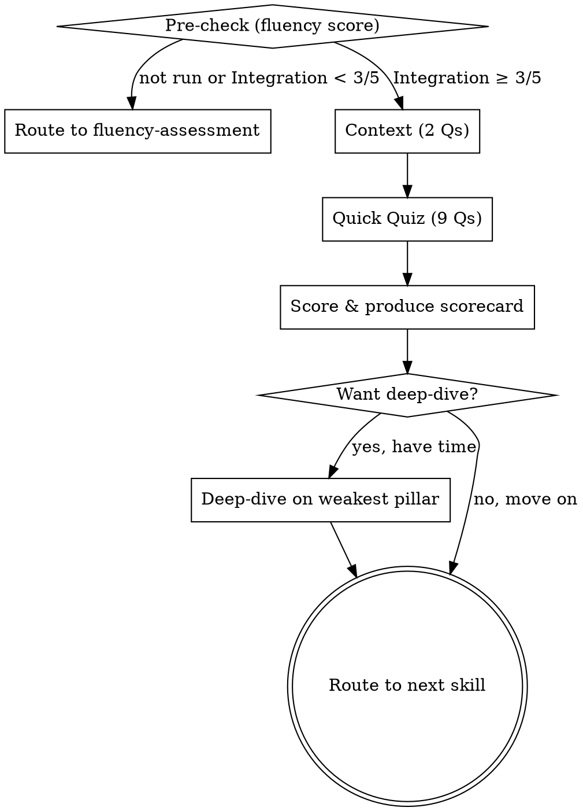

# AI Reporting Readiness Assessment

## Purpose

Quick diagnostic that scores an organization's AI reporting readiness across three pillars: outcome rigor, risk posture, and board defensibility. Produces a one-page scorecard showing whether AI investment claims would survive CFO review, external audit, or board scrutiny.

This skill is **Stage 2** of the playbook. It runs AFTER `fluency-assessment` for organizations that have moved past adoption (Integration score ≥ 3/5). A team that hasn't adopted AI yet doesn't need this skill — it needs `blocker-diagnosis` or `first-use-case-picker` first.

**Core principle:** Diagnose before you prescribe. This skill assesses reporting maturity — it does NOT build methodology, draft narratives, or calculate ROI. Those are separate skills (`roi-calculator`, `board-ai-update`).

**Audience:** Founders, CTOs, CAIOs, VPs of Engineering, and Heads of AI past the pilot stage who now face "how do you know it's working?" from a CFO, board, or investor.

**Time:** Under 5 minutes for the quick quiz. Optional deep-dive available if the leader wants to go deeper on a specific pillar.

## Flow



## Process

<HARD-GATE>
1. Ask ONE question at a time. Never batch questions.
2. Wait for the leader's actual answer before proceeding. Never simulate or assume answers.
3. Present quiz questions with their multiple-choice options. The leader picks a letter.
4. Do NOT give advice, solutions, or recommendations during the assessment. Diagnose only.
5. Do NOT suggest tools, methodology, report templates, or compliance steps. That comes from other skills after this one.
6. If fluency-assessment hasn't run or scored Integration < 3/5, route back. This skill is premature for pre-adoption teams.
</HARD-GATE>

### Step 1: Pre-check

Confirm the leader has run `fluency-assessment` and scored Integration ≥ 3/5. Ask:

> **"Have you run the fluency-assessment? If yes, what did you score on Integration?"**

**If they haven't run it:** Route to `fluency-assessment` and stop. Say:

> "This assessment measures whether your AI reporting would survive board scrutiny. That's a different question from whether your team has adopted AI. Run fluency-assessment first — if your Integration score is 3/5 or higher, come back here."

**If they scored Integration < 3/5:** Route per fluency-assessment routing logic. Say:

> "Reporting rigor is premature when adoption isn't there yet. Your fluency-assessment routing already pointed you to the right next skill. Run that first."

**If Integration ≥ 3/5:** Proceed to Step 2.

### Step 2: Context (2 questions)

Get just enough context to interpret the answers. Ask one at a time:

1. **"Who are you trying to defend your AI investment to — board, CFO, external auditor, investors, or several of these?"**
2. **"Are you based in the EU, doing business with EU customers, or otherwise in scope for the EU AI Act?"**

The first question shapes which pillar matters most. The second determines whether Q5 (regulatory readiness) weights EU AI Act heavily or adapts to NIST AI RMF, ISO/IEC 42001, or sector-specific frameworks.

### Step 3: Quick Quiz (9 questions)

Ask ONE question at a time. Present the options exactly as written. The leader picks A, B, C, or D. Each answer maps to a score (shown in brackets — do NOT show the scores to the leader).

**Outcome Rigor (3 questions)**

**Q1. How do you calculate cost saved from AI use cases?**
- A) We don't calculate it — savings are anecdotal [1]
- B) Each owner estimates their own number, no standard method [2]
- C) Standard hourly rates × hours saved, but gross of AI tool spend [3]
- D) Net of total AI cost (build + run) with documented assumptions and ranges per use case [4]

**Q2. How do you measure speed gained from AI?**
- A) Anecdotal — "tickets resolve faster now," no numbers [1]
- B) Current speed measured, no pre-AI baseline exists [2]
- C) Pre-AI baseline exists informally — single observation or remembered estimate [3]
- D) Documented pre-AI median over a defined period, with sample size and exclusion criteria [4]

**Q3. When you claim AI contributes to revenue, what's your attribution method?**
- A) We don't attribute revenue to AI [1]
- B) Intuitive correlation — "we launched the feature, revenue went up" [2]
- C) One method (AI-priced feature revenue or similar), no isolation of confounders [3]
- D) Each revenue claim names a method from a documented set — direct, A/B incrementality, or functional proxy [4]

**Risk Posture (3 questions)**

**Q4. How are your AI use cases classified by risk tier?**
- A) No tier classification — all use cases treated the same [1]
- B) Informal sense of "high stakes vs not," not documented [2]
- C) Two-tier system with informal criteria [3]
- D) Three-tier framework with documented criteria mapped to EU AI Act and NIST AI RMF [4]

**Q5. How prepared are you for the August 2, 2026 EU AI Act high-risk obligations?**

> Note for non-EU organizations: If the leader said in Step 2 they're not in EU scope, score this question on equivalent regulatory readiness — NIST AI RMF, ISO/IEC 42001, or sector-specific (HIPAA, SOC 2 AI extensions). Replace "EU AI Act" with the applicable framework in the question wording.

- A) Aware of the regulation, no specific preparation underway [1]
- B) Legal flagged the deadline, no use cases mapped yet [2]
- C) High-risk use cases identified, readiness checklist per use case with gaps documented [3]
- D) High-risk use cases audit-ready, external counsel reviewed, readiness tracked as a board metric [4]

**Q6. How do you detect, log, and respond to AI errors or policy violations?**
- A) No incident tracking — errors discovered by accident or by customers [1]
- B) Incidents tracked informally in Slack threads or email, no central log [2]
- C) Simple incident log captures what happened, not why or what changed [3]
- D) Incidents and near-misses logged with root cause, owner, fix, and follow-up — reviewed quarterly [4]

**Board Defensibility (3 questions)**

**Q7. How often does AI get to the board with structured impact numbers?**
- A) AI is never on the board agenda [1]
- B) AI comes up reactively — when something goes wrong or a vendor demos [2]
- C) AI gets quarterly board reporting with cost, speed, and revenue impact numbers [3]
- D) AI is a standing board agenda item, CFO presents alongside financial results, methodology versioned [4]

**Q8. Has your CFO formally approved the methodology you use to calculate AI ROI?**
- A) No documented methodology — numbers come from owner estimates [1]
- B) Each function uses their own method, no consolidation or review [2]
- C) Unified methodology exists, CFO has seen outputs but not signed the method [3]
- D) CFO has approved the methodology in writing, versioned, change-controlled [4]

**Q9. What share of your AI reporting is outcomes vs activity?**
- A) Reporting is entirely activity-based — adoption rate, license usage, fluency scores [1]
- B) Activity metrics dominate; one or two outcome numbers exist but unverified [2]
- C) Activity and outcome metrics reported side by side, no clear hierarchy [3]
- D) Outcome metrics primary; activity metrics labeled as inputs to outcome calculations [4]

### Step 4: Score

**Scoring method:**
- Each answer maps to a score of 1-4 (shown in brackets above)
- Per pillar: average the 3 question scores, then map to 1-5 scale:
  - Average 1.0-1.5 → **Score 1/5**
  - Average 1.6-2.2 → **Score 2/5**
  - Average 2.3-2.9 → **Score 3/5**
  - Average 3.0-3.6 → **Score 4/5**
  - Average 3.7-4.0 → **Score 5/5**
- Overall: average the three pillar scores

**Scoring guidance:**
- Score reflects the PROBLEM severity, not the team's competence. A score of 2/5 on Outcome Rigor means "AI numbers would not survive CFO scrutiny."
- Be honest. Leaders need accurate diagnosis, not encouragement.
- Higher score = better reporting readiness (more rigor, lower regulatory risk, stronger board defensibility).
- **Score evidence, not intent.** A leader who plans to document methodology next quarter is not yet at L4. Score what exists today.

Produce the scorecard using the Output format below.

### Step 5: Offer Optional Deep-Dive

After presenting the scorecard:

> "This scorecard reflects your perspective in under 5 minutes. If you have 10 more minutes, I can do a deeper dive on your weakest pillar — [name it] — to understand the specific gaps. Want to do that, or move to the next step?"

**If they want the deep-dive:** Use the Deep-Dive Probes section below on the lowest-scoring pillar only. Ask 3-4 targeted questions. Update the scorecard if the deep-dive changes your assessment.

**If they want to move on:** Route to the next skill.

### Step 6: Route to Next Skill

Based on the scorecard, recommend ONE next step. See the Next Skill section below.

## Deep-Dive Probes

Use these ONLY if the leader opts for the deeper assessment on a specific pillar. Ask 3-4 questions from the relevant section.

### Outcome Rigor Deep-Dive

- What's the loaded hourly rate you use for cost calculations? Do you differentiate senior vs junior rates?
- For your highest-impact AI use case, what's the gross saving and what's the net after subtracting tool spend?
- For your best-documented speed-gain use case, what was the pre-AI measurement period and sample size?
- When you've claimed revenue contribution from AI, has the CFO accepted the number without challenge?
- Have you ever recalibrated a saving claim after the fact? What triggered it?

**What you're listening for:**

| Signal | Issue | Severity |
|--------|-------|----------|
| "We use one rate for everyone" | Loaded rates not differentiated | High |
| "Tool spend is in a separate report" | Gross savings only, not net | High |
| "Got faster, no baseline" | Unfalsifiable speed claim | Critical |
| "CFO has never pushed back" | Either great methodology or CFO disengaged | Medium |
| "We've never recalibrated" | No feedback loop on claim accuracy | Medium |

### Risk Posture Deep-Dive

- Which of your AI use cases would be high-risk under EU AI Act Annex III (or equivalent local framework)?
- For each Tier 1 use case, who has reviewed the audit trail in the last 90 days?
- When was your last AI incident? Can you describe what happened, root cause, and fix?
- What's the difference between a Tier 2 and Tier 3 use case in your classification?
- Has external counsel or a third-party auditor ever reviewed your AI compliance posture?

**What you're listening for:**

| Signal | Issue | Severity |
|--------|-------|----------|
| "We don't have Tier 1 use cases" but org uses AI in hiring | Misclassification | Critical |
| Silence on "last incident" | No incident tracking exists | High |
| Tier definitions vary across team members | No documented criteria | High |
| No external review ever conducted | Posture untested | Medium |
| Tier 1 audit trail not reviewed in 90+ days | Stale governance | High |

### Board Defensibility Deep-Dive

- When did AI last appear in the board pack? In what section — strategy, financial, or risk?
- If a board member asked "show me the methodology behind the €X saved claim," who would answer and how?
- What's the difference between what your team reports to the board and what your team actually does with AI?
- Has any AI claim ever been challenged in a board meeting? What happened?
- Would an external auditor be able to verify your AI cost saving number from raw data?

**What you're listening for:**

| Signal | Issue | Severity |
|--------|-------|----------|
| "AI is in strategy, not financials" | Soft reporting — not held to same rigor | Medium |
| "I would answer" but no doc exists | Methodology in head, not on paper | High |
| Gap between reported and actual usage | Selection bias in reporting | High |
| "Board has never challenged" | Could be great work or disengaged board | Medium |
| Auditor verification not possible | Audit risk in real terms | Critical |

## Anti-Patterns

### "We Have a Dashboard"
**Symptom:** Leader points to activity dashboards as evidence of measurement.
**Consequence:** Activity is not outcomes. Dashboards full of adoption rates don't answer CFO questions about ROI.
**Fix:** "Walk me through the cost saved calculation behind one specific use case. What's the formula? What are the assumptions? Don't tell me about adoption."

### "Our Numbers Are Conservative"
**Symptom:** Leader defends point estimates as conservative without exposing methodology.
**Consequence:** Conservative without methodology is still indefensible — the auditor doesn't know which way the bias runs.
**Fix:** "What's the range? What assumption moves the number from low end to high end? Why is the low end what it is?"

### "The Regulation Doesn't Apply to Us"
**Symptom:** Non-EU leader dismisses Q5 entirely.
**Consequence:** Scope creep applies if you do business with EU customers, process EU citizen data, or your customers are themselves in EU scope.
**Fix:** "Do any of your customers operate in the EU? Do you process data of EU citizens? Most B2B SaaS gets pulled in indirectly. Don't dismiss this without checking."

### "We'll Build the Methodology When We Need It"
**Symptom:** Leader defers reporting rigor until "we have more results" or "the board asks."
**Consequence:** Methodology built under board pressure is methodology built badly. First time the board asks is the wrong time to start documenting.
**Fix:** "Build methodology now, before the pressure. Six months of documented assumptions beats one week of hasty justification."

### Advice Creep
**Symptom:** You start suggesting methodology fixes, tier classifications, or report templates mid-assessment.
**Consequence:** Diagnosis gets contaminated. Leader anchors on premature recommendations.
**Fix:** STOP. Return to the next question. Recommendations come from other skills.

## Output

After all questions, produce the scorecard in this exact format:

```
## AI Reporting Readiness Scorecard
**Company:** [name] | **Audience:** [board / CFO / auditor / investors] | **Date:** [date]
**Regulatory scope:** [EU AI Act in scope / NIST AI RMF / ISO 42001 / sector: __]

### Scores (1-5 scale)

| Pillar | Score | One-line summary |
|--------|:-----:|------------------|
| Outcome Rigor | X/5 | [key finding] |
| Risk Posture | X/5 | [key finding] |
| Board Defensibility | X/5 | [key finding] |
| **Overall** | **X/5** | **[overall status]** |

### Readiness Levels
- **1** — Pre-reporting. AI is happening, but the org cannot defend it to a board. Pilot purgatory by another name.
- **2** — Activity-led. Reporting exists but it's adoption-shaped, not outcome-shaped. The CFO is skeptical.
- **3** — Outcome-shaped. The right metrics are reported. Methodology is informal. Audit risk remains.
- **4** — Methodology-led. CFO has signed off on methods. Documented assumptions. Regulatory readiness work underway.
- **5** — Audit-ready. The AI section of the board report has the same rigor as financial reporting. Defensible end to end.

### Data Source
**Based on:** [Leader quiz / Leader quiz + deep-dive]

### Top Finding
[Single most important gap in 2-3 sentences]

### Biggest Risk
[What will go wrong if they do nothing, in 1-2 sentences]

### Regulatory Deadline
[If EU AI Act in scope: "[X] days until August 2, 2026 EU AI Act enforcement for high-risk AI systems." Otherwise omit this line.]

---
*Generated by [AI Adoption Playbook](https://github.com/adimango/ai-adoption-playbook) v1.1.0 on [YYYY-MM-DD]*
```

## Next Skill

Based on the scorecard, recommend ONE next step:

| Lowest-scoring pillar | Recommended next skill | Why |
|----------------------|----------------------|-----|
| Outcome Rigor | `roi-calculator` | Methodology must exist before numbers get believed |
| Risk Posture | `quarterly-review` | Tier classification and regulatory readiness fit the quarterly cadence |
| Board Defensibility | `board-ai-update` | Format and cadence problem — solve the artifact first |
| Tied or all low | `roi-calculator` | Numbers must be defensible before they're reported |

> "Your biggest gap is [pillar]. I'd recommend running [skill name] next to [one sentence on what it does]. Want to do that now?"

## References

- `fluency-assessment` — prerequisite skill. Must score Integration ≥ 3/5 before running this skill.
- `roi-calculator` — chains from this skill when Outcome Rigor is the main gap.
- `board-ai-update` — chains from this skill when Board Defensibility is the main gap.
- `quarterly-review` — chains from this skill when Risk Posture is the main gap. Recommended cadence: re-run this Stage 2 assessment manually each quarter alongside `quarterly-review`'s fluency re-run, until quarterly-review natively orchestrates both stages.
- `full-adoption-cycle` — orchestrates Stage 1 (adoption). This skill is the Stage 2 follow-up: run it separately once the team has Integration ≥ 3/5 and the question shifts from "are we using AI?" to "can we defend the numbers?"
