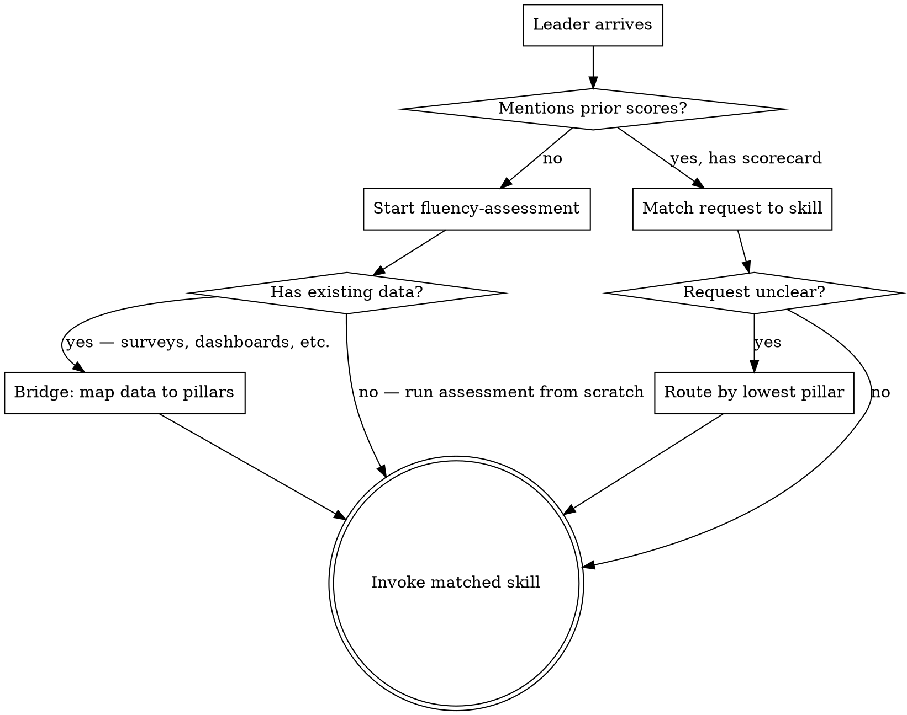

# Using the AI Adoption Playbook

## Purpose

Routes leaders to the right skill. Works for founders, CTOs, VPs of Engineering, CAIOs, COOs, consultants — anyone responsible for AI adoption. Enforces the rule that fluency-assessment runs first. If they've already completed the assessment, routes based on their request and scorecard results.

## Flow

## Process

### Step 1: Welcome and Start the Assessment

**Do NOT ask "have you done an assessment before?"** Most people haven't, and the question creates confusion. Instead, acknowledge what they're dealing with and go straight into the first question.

> "Let's figure out where your team actually stands with AI. I've got a quick quiz — 9 questions, under 5 minutes. You pick A/B/C/D for each one, and at the end you'll have a scorecard with actual numbers across three areas: your team's mindset, how tools fit your workflow, and who owns making this work.
>
> After that, I'd recommend sending a 5-minute survey to your team in parallel — your perspective is valuable, but hearing directly from the people using (or avoiding) the tools gives us a sharper picture.
>
> First, two quick context questions. Tell me about your team — how big, what they do, and what's your role?"

This IS the fluency-assessment starting. You're not routing to it — you're beginning it directly. The survey is a parallel track, not a blocker.

**If they mention having prior scores:** Accept them and route forward. "Great — what were your scores? Even rough ones work."

**If they mention having existing data** (surveys, tool dashboards, engagement reports): Help them bridge it to our framework. See Step 1b.

### Step 1b: Bridge Existing Data to the Framework

Many leaders have done employee surveys, have tool usage dashboards, or have some sense of where things stand — but not in our three-pillar format. Help them translate.

| They have... | How to bridge it |
|-------------|-----------------|
| Employee survey results | "What did people say about AI tools? Let's sort those responses into three buckets: resistance and fear, tool/workflow complaints, and 'nobody owns this' themes." |
| Tool dashboard / usage stats | "Usage data tells us about integration, but not psychology or ownership. Let's use your numbers for Pillar 2, and I'll ask a few questions to fill in the other two." |
| Anecdotal sense ("I think people are resistant") | "That's a starting hypothesis. Let me ask a few specific questions to confirm it and score it — your gut feel might be right, but the board needs numbers." |
| A previous assessment from a different framework | "Walk me through what you found. I'll map it to our three pillars — psychological barriers, integration failures, ownership gaps — and we'll see where the gaps are." |

After bridging, you should have enough to produce a rough scorecard (even if some scores are estimated). Label estimated scores as "(estimated)" and proceed.

### Step 2: Route Based on Request

Once a scorecard exists, match the founder's request to a skill:

| Founder says something like... | Route to |
|-------------------------------|----------|
| "Board meeting coming up" / "need a board update" / "investor questions" | `board-narrative-coach` |
| "We're stuck" / "nobody's using it" / "adoption stalled" | `blocker-diagnosis` |
| "Where should we start?" / "what's the best first use case?" | `first-use-case-picker` |
| "Need a plan" / "roadmap" / "what do we do next?" | `90-day-plan-builder` |
| "Run the full process" / "start to finish" / "everything" | `full-adoption-cycle` |
| "How much are we spending?" / "are we wasting money?" | `tool-stack-audit` |
| "Show me the numbers" / "ROI" / "is it worth it?" | `roi-calculator` |
| "I need a snapshot" / "who's using what?" | `adoption-scorecard` |
| "Quarterly check-in" / "compare to last time" | `quarterly-review` |

### Step 3: Handle Unclear Requests

If the founder's request doesn't clearly match a skill, use their scorecard to recommend:

| Lowest pillar | Recommend | Say |
|--------------|-----------|-----|
| Psychological Barriers | `blocker-diagnosis` | "Your scores suggest people resistance is the main issue. Let's dig into what's blocking your team." |
| Integration Failures | `first-use-case-picker` | "Looks like the tools aren't fitting your workflow. Let's find the right starting point." |
| Ownership Gaps | `90-day-plan-builder` | "The biggest gap is that nobody owns this yet. Let's build a plan with owners and milestones." |

## Anti-Patterns

### Skipping the Assessment
**Symptom:** Founder says "I know what I need, just help me with X."
**Consequence:** Without a fluency scorecard, you're giving advice without diagnosis.
**Fix:** "I hear you. But without understanding where your team actually stands, any advice I give is generic. The assessment takes 20 minutes and makes everything after it specific to your situation."

### Routing to the Wrong Skill
**Symptom:** Founder says "we need a plan" but their real issue is that their senior engineers won't touch AI tools.
**Consequence:** A 90-day plan built on top of undiagnosed psychological resistance will fail.
**Fix:** If the scorecard shows a critical gap in one pillar but the founder wants a different skill, flag it. "Your scorecard shows a 1/5 on psychological barriers. A plan won't help until we understand that resistance. Want to run blocker-diagnosis first?"

## Output

This skill does not produce its own artifact. Its output is invoking the correct next skill.

## Next Skill

Whichever skill matches the routing logic above. Terminal state is the invoked skill taking over.

## References

- `fluency-assessment` — always the first skill if no scorecard exists
- All other skills — this meta-skill routes to any of them
